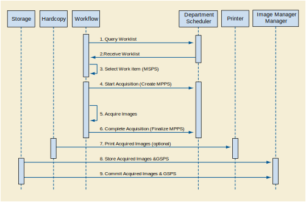

Sequencing of Real-World Activities
^^^^^^^^^^^^^^^^^^^^^^^^^^^^^^^^^^^

   Figure : Sequencing of Real-World Activities

Under normal scheduled workflow conditions the sequencing constraints illustrated in Figure B.4.1-2 apply:

Query Worklist

Receive Worklist of Modality Scheduled Procedure Steps (MSPS)

Select Workitem (MSPS) from Worklist

Start acquisition and create MPPS

Acquire Images

Complete acquisition and finalize MPPS

Print acquired images (optional step)

Store acquired images and any associated Grayscale Softcopy Presentation State (GSPS) instances.

If the Image Manager is configured as an archive device the Storage AE will request Storage Commitment for the images and associated GSPS instances.

Other workflow situations (e.g., unscheduled procedure steps) will have other sequencing constraints. Printing could equally take place after the acquired images have been stored. Printing could be omitted completely if no printer is connected or hard copies are not required.