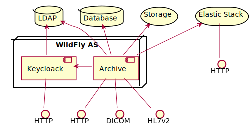
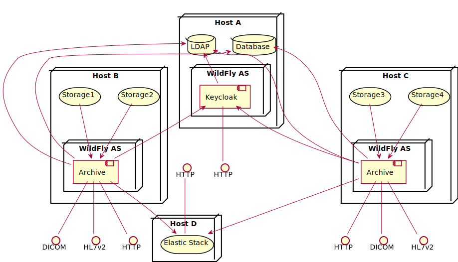
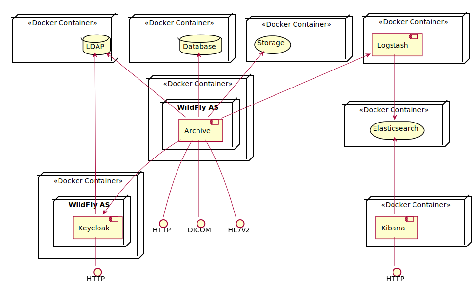
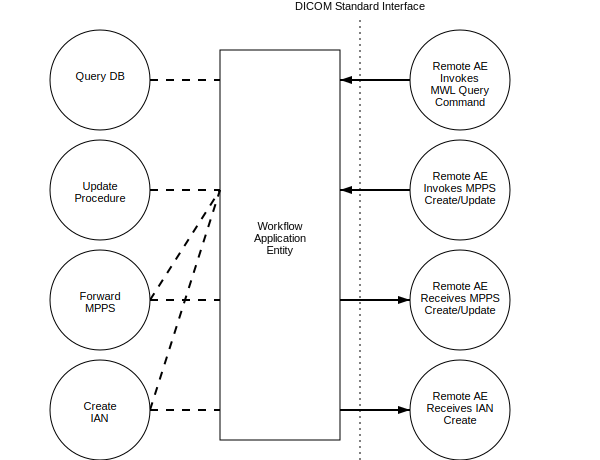
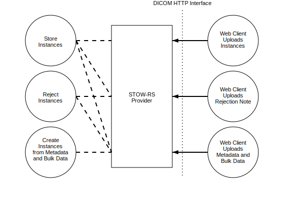
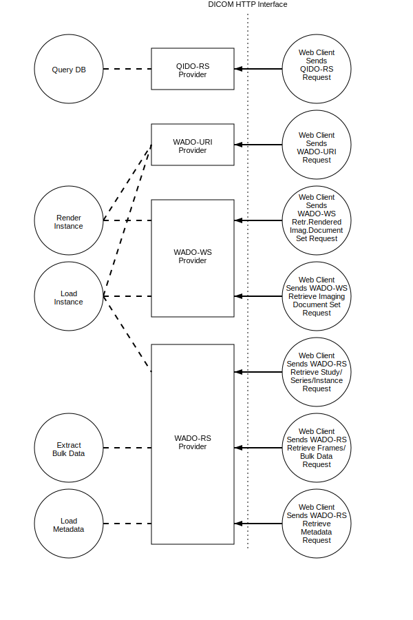

Application Data Flow
^^^^^^^^^^^^^^^^^^^^^

The core component of |product| is a Java Enterprise Application deployed in `WildFly AS <http://www.wildfly.org/>`_,
which provides DICOM services over the DICOM Upper Layer protocol (DUL) and HTTP, HL7 v2 services over the Minimal Lower
Layer Protocol (MLLP), various proprietary RESTful services and a Web UI accessable by HTML 5 compliant web browsers.

It uses any LDAP v3 compatible LDAP server as configuration backend and a relational database for supporting
query and data management services.

The received DICOM objects are not stored in the database, but in a separated storage backend - typically any
type of file system, but also cloud storage supported by `Apache jclouds <https://jclouds.apache.org>`_ may be used
as storage backend.

System-log and audit messages may be stored into the `Elastic Stack <https://www.elastic.co/products>`_.

RESTful services and the Web UI may be secured with `OpenID Connect <http://openid.net/connect/>`_ using
`Keycloak <http://www.keycloak.org>`_ as Authentication Server.

   System components

System components may be distributed over multiple hosts, as multiple instances of the Archive Application may share
one LDAP server and one database.

   Multi-host deployment

System components of |product| are also available as Docker images to run within Docker containers.

   Docker deployment

Conceptually the network services may be modeled as the following separate AEs, though they may share one
AE Title, or one AE may have multiple instances identified by different AE Titles, with different configuration.

- :doc:`fktdefs/storage`, which receives incoming images and other Composite Object Instances and accepts requests for
  commitment for the safekeeping of the received objects.
- :doc:`fktdefs/query-retrieve`, which processes queries for Patient, Study, Series, and Instance information and also
  processes retrieval requests, sending the requested objects to the retrieve destination AE.
- :doc:`fktdefs/workflow`, which processes queries for Scheduled Procedure Steps, receives  Performed Procedure Step
  messages and optionally forwards them to any remote AE, and also notifies remote AEs about the availability of
  received instances.
- :doc:`fktdefs/stow-rs`, which receives DICOM Objects or metadata with bulkdata via HTTP POST requests.
- :doc:`fktdefs/qido-rs`, which provides access to Patient, Study, Series, and Instance data of received objects via
  HTTP GET requests.
- :doc:`fktdefs/wado-uri`, which provides access to individual DICOM Objects - as DICOM file or rendered to
  non-DICOM media types for display - via HTTP GET requests.
- :doc:`fktdefs/wado-rs`, which provides access to the metadata, the bulk data or the whole DICOM Objects, of a
  whole Study or Series or an individual object via HTTP GET requests.
- :doc:`fktdefs/wado-ws`, which provides access to DICOM Objects - as DICOM file or rendered to non-DICOM media types
  for display - via SOAP HTTP Requests.

.. figure:: application-data-flow-diagram.svg

   Application Data Flow Diagram

   Workflow Application Data Flow Diagram

   Web Storage Application Data Flow Diagram

   Web Access Application Data Flow Diagram
