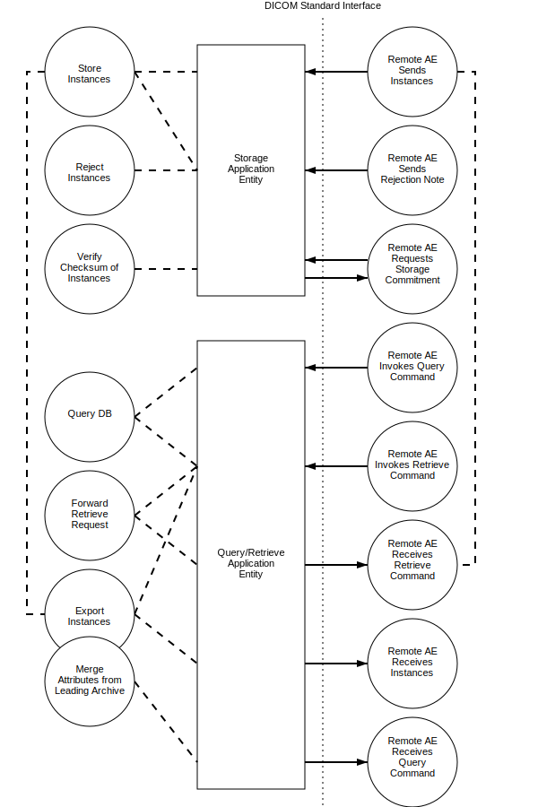
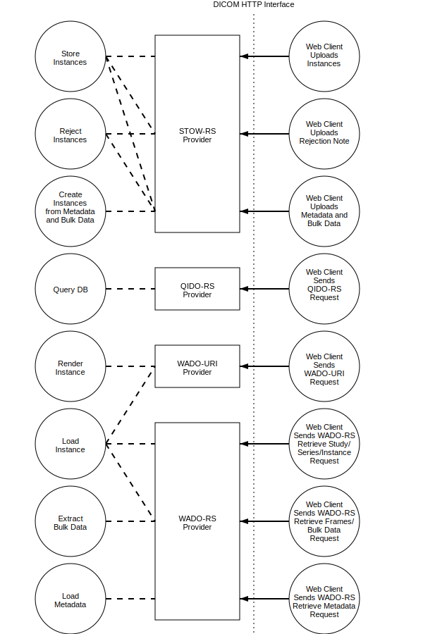

Application Data Flow
^^^^^^^^^^^^^^^^^^^^^

The division of |product| into the separate DICOM Application Entities represents a somewhat arbitrary partitioning
of functionality. For the purpose of this document they are organized in this manner so as to detail their independent
logical functionality.

By default all of the defined Application Entities share the same Application Entity Title. However, |product| can be
configured that the Application Entities have different AE Titles.

   Figure 5.1-1. Application Data Flow Diagram

   Figure 5.1-2. Web Application Data Flow Diagram
