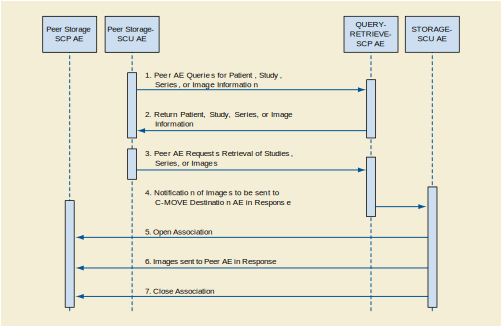
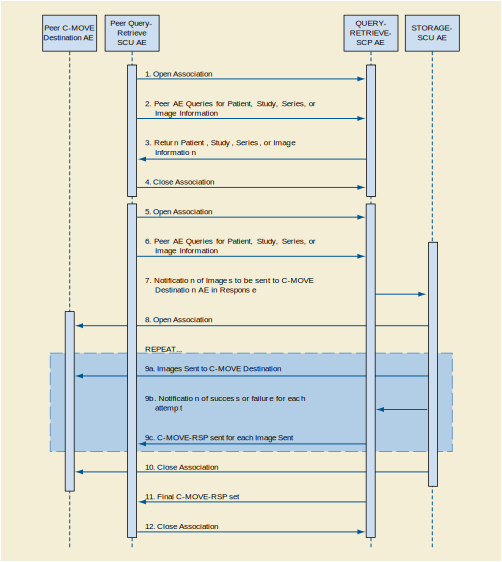

Query/Retrieve Application Entity Specification
^^^^^^^^^^^^^^^^^^^^^^^^^^^^^^^^^^^^^^^^^^^^^^^

.. _query-retrieve-sop-classes:

SOP Classes
"""""""""""

The Query/Retrieve Application Entity provides Standard Conformance to the following SOP Classes:

.. csv-table:: SOP Classes for Query/Retrieve Application Entity
   :name: SOPClasses2
   :header: "SOP Class Name", "SOP Class UID", "SCU", "SCP"
   :file: sop-classes.csv

These are the default SOP Classes supported. By altering the configuration it is possible to support additional or fewer SOP Classes.

.. _association-policies:

Association Policies
""""""""""""""""""""

.. _general:

General
'''''''

The STORAGE-SCU AE can only form Associations when requested to do so by the DCM4CHEE SCP AE. The STORAGE-SCU AE can only request the opening of an Association. It cannot accept requests to open Associations from external Application Entities.
The DCM4CHEE SCP AE will never initiate Associations; it only accepts Association Requests from external DICOM AEs. The DCM4CHEE SCP AE will accept Associations for Verification, C-FIND, and C-MOVE requests. In the case of a C-MOVE request, the DCM4CHEE SCP AE will issue a command to the STORAGE-SCU AE to initiate an Association with the Destination DICOM AE to send images as specified by the originator of the C-MOVE Request.
The DICOM standard Application Context Name for DICOM 3.0 is always proposed (Storage SCU) / accepted (Query/Retrieve SCP).

.. csv-table:: DICOM Application Context for STORAGE-SCU AE & DCM4CHEE SCP AE
   :file: common/storage-query-retrieve-workflow-general.csv

.. _number-of-associations:

Number Of Associations
''''''''''''''''''''''

The maximum number of simultaneous Associations is configurable, but is usually limited to a maximum of 10. This configuration largely depends on whether relatively quick response to multiple simultaneous C-MOVE Destination AEs is required or maximum throughput performance is required. If the latter is the case, then no simultaneous Associations are permitted, in order to reduce disk thrashing and thus maximize throughput. The STORAGE-SCU AE can initiate simultaneous Associations to a given external C-MOVE Destination AE up to the maximum number configured. There is no separate limit on the maximum number permitted to the same C-MOVE Destination AE.
If the first attempt to open an Association fails then the STORAGE-SCU AE will reschedule the task to attempt it again after a configurable time delay. The number of times to reattempt Association establishment is configurable, with the default being zero.
The DCM4CHEE SCP AE can support multiple simultaneous Associations. Each time the DCM4CHEE SCP AE receives an Association, a child process will be spawned to process the Verification, Query, or Retrieval request. The maximum number of child processes, and thus the maximum number of simultaneous Associations that can be processed, is set by configuration. The default maximum is 10 in total. The maximum number of simultaneous Associations can be either an absolute number or a maximum number for each requesting external Application Entity. The latter flexibility can be useful if communication with one external AE is unreliable and one does not wish 'hung' connections with this AE to prevent Associations with other client AEs.

.. csv-table:: Number of Associations as a SCU for STORAGE-SCU AE / SCP for Query-Retrieve SCP AE
   :file: number-of-associations.csv

.. _asynchronous-nature:

Asynchronous Nature
'''''''''''''''''''

The Storage SCU AE and Query/Retrieve SCP AE do not support asynchronous communication (multiple outstanding transactions over a single Association). All Association requests must be completed and acknowledged before a new operation can be initiated.

.. csv-table:: Asynchronous Nature as a SCU for STORAGE-SCU AE / SCP for Query-Retrieve SCP AE
   :file: asynchronous-nature.csv

.. _storage-scu-implementation-identifying-info:

Implementation Identifying Information
''''''''''''''''''''''''''''''''''''''

The implementation information for the Application Entity is:

.. csv-table:: DICOM Implementation Class and Version for STORAGE-SCU / Query-Retrieve SCP AE
   :file: common/storage-query-retrieve-implementation-identifying-information.csv

Note that the STORAGE-SCU AE and Query/Retrieve SCP AE use the same Implementation Class UID. All DCM4CHEE archive AEs use the same Implementation Version Name. This Version Name is updated with each new release of the product software, as the different AE versions are never released independently.

.. _association-initiation-policy:

Association Initiation Policy
"""""""""""""""""""""""""""""

.. _activity:

Activity - Send Images Requested By an External Peer AE
'''''''''''''''''''''''''''''''''''''''''''''''''''''''

.. _description:

Description and Sequencing of Activity
......................................

The Storage SCU AE will initiate a new Association when the Query/Retrieve SCP AE invokes the Storage SCU AE to transmit images. The Query/Retrieve SCP AE will issue such a command whenever it receives a valid C-MOVE Request. An Association Request is sent to the specified C-MOVE Destination AE and upon successful negotiation of the required Presentation Context the image transfer is started. In all cases an attempt will be made to transmit all the indicated images in a single Association, but this may not always be possible. The Association will be released when all the images have been sent. If an error occurs during transmission over an open Association then the image transfer is halted. The Storage SCU AE will not attempt to independently retry the image export.
Note that the Storage SCU AE does not support the unsolicited sending of SOP Instances using the DICOM Storage Service Class. It will only send SOP Instances in response to a C-MOVE Request from a peer AE.

   Figure : Sequencing of Activity - Send Images Requested By an External Peer AE

The following sequencing constraints illustrated in figure above apply to the Storage SCU AE:

1. Peer AE requests retrieval of Study, Series, or Images from Query/Retrieve SCP AE (C-MOVE-RQ).
2. Query/Retrieve SCP AE signals Storage SCU AE to send the image Composite SOP Instances indicated in the C-MOVE-RQ to the C-MOVE Destination AE.
3. Storage SCU AE opens a new Association with the indicated C-MOVE Destination AE.
4. Storage SCU AE sends the indicated Composite SOP Instances.
5. Storage SCU AE closes the Association.
6. The Verification Service is only supported as a utility function for Service staff. It is used only as a diagnostic tool.

.. _proposed_presentation_contexts:

Proposed Presentation Contexts
..............................

The Query/Retrieve Application Entity will propose Presentation Contexts for Verification, Study Root Query/Retrieve Information Model - FIND,
Study Root Query/Retrieve Information Model - MOVE and of supported Storage SOP Classes.

.. table:: Proposed Presentation Contexts by the Query/Retrieve Application Entity

   +-----------------------------------------------------------------------------------------------------------------------------------------------+
   | Presentation Context Table                                                                                                                    |
   +-------------------------------------------------------------+--------------------------------------------------------------+------+-----------+
   | | Abstract Syntax                                           | Transfer Syntax                                              | Role | Ext. Neg. |
   +-------------------------------+-----------------------------+------------------------------------+-------------------------+      |           |
   | | Name                        | UID                         | Name                               | UID                     |      |           |
   +===============================+=============================+====================================+=========================+======+===========+
   | | Verification                | 1.2.840.10008.1.1           | Implicit VR Little Endian          | 1.2.840.10008.1.2       | SCU  | None      |
   +-------------------------------+-----------------------------+------------------------------------+-------------------------+------+-----------+
   | | Study Root Query/Retrieve   | 1.2.840.10008.5.1.4.1.2.2.1 | Implicit VR Little Endian          | 1.2.840.10008.1.2       | SCU  | None      |
   | | Information Model - FIND    |                             |                                    |                         |      |           |
   +-------------------------------+-----------------------------+------------------------------------+-------------------------+------+-----------+
   | | Study Root Query/Retrieve   | 1.2.840.10008.5.1.4.1.2.2.2 | Implicit VR Little Endian          | 1.2.840.10008.1.2       | SCU  | None      |
   | | Information Model - MOVE    |                             |                                    |                         |      |           |
   +-------------------------------+-----------------------------+------------------------------------+-------------------------+------+-----------+
   | | Image Storage SOP Class in :numref:`SOPClasses2`          | s. :numref:`SCUImageTS`                                      | SCU  | None      |
   +-------------------------------------------------------------+--------------------------------------------------------------+------+-----------+
   | | Video Storage SOP Class in :numref:`SOPClasses2`          | s. :numref:`SCUVideoTS`                                      | SCU  | None      |
   +-------------------------------------------------------------+------------------------------------+-------------------------+------+-----------+
   | | SR Storage SOP Class in :numref:`SOPClasses2`             | Implicit VR Little Endian          | 1.2.840.10008.1.2       | SCU  | None      |
   |                                                             +------------------------------------+-------------------------+      |           |
   |                                                             | Explicit VR Little Endian          | 1.2.840.10008.1.2.1     |      |           |
   |                                                             +------------------------------------+-------------------------+      |           |
   |                                                             | Deflated Explicit VR Little Endian | 1.2.840.10008.1.2.1.99  |      |           |
   +-------------------------------------------------------------+------------------------------------+-------------------------+------+-----------+
   | | Other Storage SOP Class in :numref:`SOPClasses2`          | Implicit VR Little Endian          | 1.2.840.10008.1.2       | SCU  | None      |
   |                                                             +------------------------------------+-------------------------+      |           |
   |                                                             | Explicit VR Little Endian          | 1.2.840.10008.1.2.1     |      |           |
   +-------------------------------------------------------------+------------------------------------+-------------------------+------+-----------+

.. csv-table:: Transfer Syntaxes for Image Storage SOP Classes
   :name: SCUImageTS
   :header: "Transfer Syntax Name", "UID"

   "Implicit VR Little Endian", "1.2.840.10008.1.2"
   "Explicit VR Little Endian", "1.2.840.10008.1.2.1"
   "JPEG Baseline (Process 1)", "1.2.840.10008.1.2.4.50"
   "JPEG Extended (Process 2 & 4)", "1.2.840.10008.1.2.4.51"
   "JPEG Lossless, Non-Hierarchical (Process 14)", "1.2.840.10008.1.2.4.54"
   "JPEG Lossless, Non-Hierarchical, First-Order Prediction (Process 14 [Selection Value 1])", "1.2.840.10008.1.2.4.70"
   "JPEG-LS Lossless", "1.2.840.10008.1.2.4.80"
   "JPEG-LS Lossy (Near-Lossless)", "1.2.840.10008.1.2.4.81"
   "JPEG 2000 (Lossless Only)", "1.2.840.10008.1.2.4.90"
   "JPEG 2000", "1.2.840.10008.1.2.4.91"
   "RLE Lossless", "1.2.840.10008.1.2.5"

.. csv-table:: Transfer Syntax for Video Storage SOP Classes
   :name: SCUVideoTS
   :header: "Transfer Syntax Name", "UID"

   "JPEG Baseline (Process 1)", "1.2.840.10008.1.2.4.50"
   "MPEG2 Main Profile @ Main Level", "1.2.840.10008.1.2.4.100"
   "MPEG2 Main Profile @ High Level", "1.2.840.10008.1.2.4.101"
   "MPEG-4 AVC/H.264 High Profile / Level 4.1", "1.2.840.10008.1.2.4.102"
   "MPEG-4 AVC/H.264 BD-compatible High Profile / Level 4.1", "1.2.840.10008.1.2.4.103"
   "MPEG-4 AVC/H.264 High Profile / Level 4.2 For 2D Video", "1.2.840.10008.1.2.4.104"
   "MPEG-4 AVC/H.264 High Profile / Level 4.2 For 3D Video", "1.2.840.10008.1.2.4.105"
   "MPEG-4 AVC/H.264 Stereo High Profile / Level 4.2", "1.2.840.10008.1.2.4.106"

.. _verification_sop_class_conformance:

SOP Specific Conformance for Verification SOP Class
...................................................

Standard conformance is provided to the DICOM Verification Service Class as an SCU. The Verification Service as an SCU is actually only supported as a diagnostic service tool for network communication issues.

.. _image_sop_class_conformance:

SOP Specific Conformance for Image SOP Classes
..............................................

Composite DICOM SOP Instances are maintained as DICOM Part 10 compliant files in the DCM4CHEE archive database. The entire set of tags received with the image will be saved in DCM4CHEE archive; this includes all Private and SOP Extended Elements. When a SOP Instance is selected for export from DCM4CHEE archive, its content will be exported as it was originally received except for a few possible exceptions. Some of the Patient demographic and Study information Elements whose values can have been altered due to changes administered on DCM4CHEE archive or changes to the state of the image data due to compression can be altered when the SOP Instance is exported.
The Patient demographic and Study information can be entered or altered by several means: manually, or from HL7 messaging,. The replacement behavior depends on which specific DICOM and HL7 services are supported. Also, this behavior is configurable. Values can be altered without changing the SOP Instance UID unless otherwise noted. Refer to the Annex for the specific details of which Elements can have their values altered at time of export.
The DCM4CHEE archive creates files called Service Logs that can be used to monitor their status and diagnose any problems that may arise. If any error occurs during DICOM communication then appropriate messages are always output to these Service Logs. In addition, error messages may be output as alerts to the User Interface in certain cases.
The Storage SCU AE will exhibit the following Behavior according to the Status Code value returned in a C-STORE Response from a destination C-STORE SCP:

.. csv-table:: STORAGE-SCU AE C-STORE Response Status Handling Behavior
   :header: "Service Status", "Further Meaning", "Error Code", "Behaviour"
   :file: storage-scu-image-sop-conformance.csv

All Status Codes indicating an error or refusal are treated as a permanent failure. The STORAGE-SCU AE never automatically resends images when an error Status Code is returned in a C-STORE Response. For specific behavior regarding Status Code values returned in C-MOVE Responses, refer to the Services Supported as an SCP by the DCM4CHEE SCP AE.

.. csv-table:: STORAGE-SCU AE Communication Failure Behavior
   :header: "Exception", "Behaviour"
   :file: storage-scu-communication-failure-behaviour.csv

.. _association-acceptance-policy:

Association Acceptance Policy
"""""""""""""""""""""""""""""

.. _query-retrieve-activity:

Activity - Handling Query and Retrieval Requests
''''''''''''''''''''''''''''''''''''''''''''''''

.. _query-retrieve-description:

Description and Sequencing of Activity
......................................

The Query/Retrieve SCP AE accepts Associations only if they have valid Presentation Contexts. If none of the requested Presentation Contexts are accepted then the Association Request itself is rejected. It can be configured to only accept Associations with certain hosts (using TCP/IP address) and/or Application Entity Titles.
If Query/Retrieve SCP AE receives a query (C-FIND) request then the response(s) will be sent over the same Association used to send the C-FIND-Request.
If Query/Retrieve SCP AE receives a retrieval (C-MOVE) request then the responses will be sent over the same Association used to send the C-MOVE-Request. The Query/Retrieve SCP AE will notify the Storage SCU to send the requested SOP Instances to the C-MOVE Destination. The Storage SCU AE notifies the Query/Retrieve SCP AE of the success or failure of each attempt to send a Composite SOP Instance to the peer C-MOVE Destination AE. The Query/Retrieve SCP AE then sends a C-MOVE Response indicating this status after each attempt. Once the Storage SCU AE has finished attempting to transfer all the requested SOP Instances, the Query/Retrieve SCP AE sends a final C-MOVE Response indicating the overall status of the attempted retrieval.

   Figure : Sequencing of Activity - Handling Query and Retrieval Requests

The following sequencing constraints illustrated in above figure apply to the DCM4CHEE SCP AE for handling queries (C-FIND-Requests) :

1. Peer AE opens an Association with the Query/Retrieve SCP AE.
2. Peer AE sends a C-FIND-RQ Message
3. Query/Retrieve SCP AE returns a C-FIND-RSP Message to the peer AE with matching information. A C-FIND-RSP is sent for each entity matching the identifier specified in the C-FIND-RQ. A final C-FIND-RSP is sent indicating that the matching is complete.
4. Peer AE closes the Association. Note that the peer AE does not have to close the Association immediately. Further C-FIND or C-MOVE Requests can be sent over the Association before it is closed.

The following sequencing constraints illustrated in above figure apply to the DCM4CHEE SCP AE for handling retrievals (C-MOVE-Requests) :

1. Peer AE opens an Association with the Query/Retrieve SCP AE.
2. Peer AE sends a C-MOVE-RQ Message
3. Query/Retrieve SCP AE notifies the Storage SCU AE to send the Composite SOP Instances to the peer C-MOVE Destination AE as indicated in the C-MOVE-RQ.
4. After attempting to send a SOP Instance, the Storage SCU AE indicates to the Query/Retrieve SCP AE whether the transfer succeeded or failed. The Query/Retrieve SCP AE then returns a C-MOVE-RSP indicating this success or failure.
5. Once the Storage SCU AE has completed all attempts to transfer the SOP Instances to the C-MOVE Destination AE, or the first failure occurred, the Query/Retrieve SCP AE sends a final C-MOVE-RSP indicating the overall success or failure of the retrieval.
6. Peer AE closes the Association. Note that the peer AE does not have to close the Association immediately. Further C-FIND or C-MOVE Requests can be sent over the Association before it is closed.

The Query/Retrieve SCP AE may reject Association attempts as shown in the table below. The Result, Source and Reason/Diag columns represent the values returned in the corresponding fields of an ASSOCIATE-RJ PDU. The following abbreviations are used in the Source column:

a. 1 - DICOM UL service-user
b. 2 - DICOM UL service-provider (ASCE related function)
c. 3 - DICOM UL service-provider (Presentation related function)

.. csv-table:: Accepted Presentation Contexts By the Query/Retrieve SCP AE
   :header: "Result", "Source", "Reason-Diag", "Explanation"
   :sub-header: "Name", "UID"
   :file: common/storage-query-retrieve-association-rejection-reasons.csv

.. _accepted-presentation-context:

Accepted Presentation Contexts
..............................

The Query/Retrieve Application Entity will accept Presentation Contexts for all SOP Classes listed in Table 4.2.1.1-1 by default.
The list of accepted Transfer Syntaxes for each accepted Abstract Syntax - as the list of accepted Abstract Syntaxes itselfs - is configurable.

.. table:: Accepted Presentation Contexts of Query/Retrieve Application Entity by default configuration

   +--------------------------------------------------------------------------------------------------------------------------------------------------+
   | Presentation Context Table                                                                                                                         |
   +---------------------------------------------------------------+--------------------------------------------------------------+------+--------------+
   | | Abstract Syntax                                             | Transfer Syntax                                              | Role | Ext. Neg.    |
   +---------------------------------+-----------------------------+------------------------------------+-------------------------+      |              |
   | | Name                          | UID                         | Name                               | UID                     |      |              |
   +=================================+=============================+====================================+=========================+======+==============+
   | | Verification                  | 1.2.840.10008.1.1           | Implicit VR Little Endian          | 1.2.840.10008.1.2       | SCP  | None         |
   +---------------------------------+-----------------------------+------------------------------------+-------------------------+------+--------------+
   | | Patient Root Query/Retrieve   | 1.2.840.10008.5.1.4.1.2.1.1 | Implicit VR Little Endian          | 1.2.840.10008.1.2       | SCP  | - Relational |
   | | Information Model - FIND      |                             |                                    |                         |      | - Date Range |
   |                                 |                             |                                    |                         |      | - Fuzzy      |
   |                                 |                             |                                    |                         |      | - Timezone   |
   +---------------------------------+-----------------------------+------------------------------------+-------------------------+------+--------------+
   | | Patient Root Query/Retrieve   | 1.2.840.10008.5.1.4.1.2.1.2 | Implicit VR Little Endian          | 1.2.840.10008.1.2       | SCP  | - Relational |
   | | Information Model - MOVE      |                             |                                    |                         |      |              |
   +---------------------------------+-----------------------------+------------------------------------+-------------------------+------+--------------+
   | | Patient Root Query/Retrieve   | 1.2.840.10008.5.1.4.1.2.1.3 | Implicit VR Little Endian          | 1.2.840.10008.1.2       | SCP  | - Relational |
   | | Information Model - GET       |                             |                                    |                         |      |              |
   +---------------------------------+-----------------------------+------------------------------------+-------------------------+------+--------------+
   | | Study Root Query/Retrieve     | 1.2.840.10008.5.1.4.1.2.2.1 | Implicit VR Little Endian          | 1.2.840.10008.1.2       | SCP  | - Relational |
   | | Information Model - FIND      |                             |                                    |                         |      | - Date Range |
   |                                 |                             |                                    |                         |      | - Fuzzy      |
   |                                 |                             |                                    |                         |      | - Timezone   |
   +---------------------------------+-----------------------------+------------------------------------+-------------------------+------+--------------+
   | | Study Root Query/Retrieve     | 1.2.840.10008.5.1.4.1.2.2.2 | Implicit VR Little Endian          | 1.2.840.10008.1.2       | SCP  | - Relational |
   | | Information Model - MOVE      |                             |                                    |                         |      |              |
   +---------------------------------+-----------------------------+------------------------------------+-------------------------+------+--------------+
   | | Study Root Query/Retrieve     | 1.2.840.10008.5.1.4.1.2.2.3 | Implicit VR Little Endian          | 1.2.840.10008.1.2       | SCP  | - Relational |
   | | Information Model - GET       |                             |                                    |                         |      |              |
   +---------------------------------+-----------------------------+------------------------------------+-------------------------+------+--------------+
   | | Image Storage SOP Class listed in :numref:`SOPClasses2`     | s. :numref:`SCUImageTS`                                      | SCU  | None         |
   +---------------------------------------------------------------+--------------------------------------------------------------+------+--------------+
   | | Any Video Storage SOP Class listed in :numref:`SOPClasses2` | s. :numref:`SCUVideoTS`                                      | SCU  | None         |
   +---------------------------------------------------------------+------------------------------------+-------------------------+------+--------------+
   | | SR Storage SOP Class listed in :numref:`SOPClasses2`        | Implicit VR Little Endian          | 1.2.840.10008.1.2       | SCU  | None         |
   |                                                               +------------------------------------+-------------------------+      |              |
   |                                                               | Explicit VR Little Endian          | 1.2.840.10008.1.2.1     |      |              |
   |                                                               +------------------------------------+-------------------------+      |              |
   |                                                               | Deflated Explicit VR               | 1.2.840.10008.1.2.1.99  |      |              |
   |                                                               | Little Endian                      |                         |      |              |
   +-------------------------------------------------------------+------------------------------------+-------------------------+------+--------------+
   | | Other Storage SOP Class listed in :numref:`SOPClasses2`     | Implicit VR Little Endian          | 1.2.840.10008.1.2       | SCU  | None         |
   |                                                               +------------------------------------+-------------------------+      |              |
   |                                                               | Explicit VR Little Endian          | 1.2.840.10008.1.2.1     |      |              |
   +---------------------------------------------------------------+------------------------------------+-------------------------+------+--------------+

.. _query-sop-class-conformance:

SOP Specific Conformance for Query SOP Classes
..............................................

The Query/Retrieve SCP AE supports hierarchical queries and not relational queries. There are no attributes always returned by default. Only those attributes requested in the query identifier are returned. Query responses always return values from the DCM4CHEE archive database. Exported SOP Instances are always updated with the latest values in the database prior to export. Thus, a change in Patient demographic information will be contained in both the C-FIND Responses and any Composite SOP Instances exported to a C-MOVE Destination AE.
Patient Root Information Model
All required search keys on each of the four levels (Patient, Study, Series, and Image) are supported. However, the Patient ID (0010,0020) key must have at least a partial value if the Patient's Name (0010,0010) is not present in a Patient Level query.
Study Root Information Model
All the required search keys on each of the three levels (Study, Series, and Image) are supported. If no partial values are specified for Study attributes then either the Patient ID (0010,0020) key or the Patient's Name (0010,0010) must have at least a partial value specified.

.. csv-table:: Patient Root C-FIND SCP Supported Elements
   :header: "Level Name/Attribute Name", "Tag", "VR", "Types of Matching"
   :file: query-retrieve-scp-patient-root-c-find-elements.csv

.. csv-table:: Study Root C-FIND SCP Supported Elements
   :header: "Level Name/Attribute Name", "Tag", "VR", "Types of Matching"
   :file: query-retrieve-study-root-c-find-elements.csv

The tables should be read as follows:

- Attribute Name: Attributes supported for returned C-FIND Responses.
- Tag: Appropriate DICOM tag for this attribute.
- VR: Appropriate DICOM VR for this attribute.
- Types of Matching: The types of Matching supported by the C-FIND SCP.

The values in 'Types of Matching' column mean as follows :

- "S" indicates the identifier attribute can specify Single Value Matching.
- "R" will indicate Range Matching.
- "*" will denote wild card matching.
- "U" will indicate universal matching.
- "L" will indicate that UID lists are supported for matching.
- "NONE" indicates that no matching is supported, but that values for this Element in the database can be returned.

.. csv-table:: Query/Retrieve SCP AE C-FIND Response Status Return Behavior
   :header: "Service Status", "Further Meaning", "Error Code", "Behaviour"
   :file: query-retrieve-scp-c-find-response-status-behaviour.csv

.. _retrieval-sop-class-conformance:

SOP Specific Conformance for Retrieval SOP Classes
..................................................

The Query/Retrieve SCP AE will convey to the Storage SCU AE that an Association with a DICOM Application Entity named by the external C-MOVE SCU (through a MOVE Destination AE Title) should be established. It will also convey to the Storage SCU AE to perform C-STORE operations on specific images requested by the external C-MOVE SCU. One or more of the Image Storage Presentation Contexts listed in Table 4.2.2.3-1. will be negotiated.
The Query/Retrieve SCP AE can support lists of UIDs in the C-MOVE Request at the Study, Series, and Image Levels. The list of UIDs must be at the Level of the C-MOVE Request however. For example, if the C-MOVE Request is for Series Level retrieval but the identifier contains a list of Study UIDs then the C-MOVE Request will be rejected, and the A900 Failed Status Code will be returned in the C-MOVE Response.
An initial C-MOVE Response is always sent after confirming that the C-MOVE Request itself can be processed. After this, the Query/Retrieve SCP AE will return a response to the C-MOVE SCU after the Storage SCU AE has attempted to send each image. This response reports the number of remaining SOP Instances to transfer, and the number transferred having a successful, failed, or warning status. If the Composite SOP Instances must be retrieved from long-term archive prior to export there may be quite a long delay between the first C-MOVE Response and the next one after the attempt to export the first image. The maximum length of time for this delay will depend on the particular type of archive used but typically varies between 3 and 10 minutes.

.. csv-table:: Query/Retrieve SCP AE C-MOVE Response Status Return Behavior
   :header: "Service Status", "Further Meaning", "Error Code", "Behaviour"
   :file: query-retrieve-c-move-response-status-behaviour.csv

Note that the Warning Status, B000 (Sub-operations complete - One or more Failures) is never returned. If a failure occurs during export to the C-MOVE Destination AE by the STORAGE-SCU AE then the entire task is aborted. Thus any remaining matches are not exported.

.. csv-table:: Query/Retrieve SCP AE Communication Failure Behavior
   :header: "Exception", "Behaviour"
   :file: query-retrieve-scp-communication-failure-behaviour.csv
