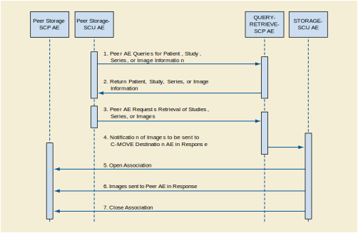

Storage Application Entity Specification
^^^^^^^^^^^^^^^^^^^^^^^^^^^^^^^^^^^^^^^^

.. _storage-sop-classes:

SOP Classes
"""""""""""

The Storage Application Entity provides Standard Conformance to the following SOP Class(es) :

.. csv-table:: Table 4.2.1.1-1.: SOP Classes for Storage Application Entity (SCP)
   :header: "SOP Class Name", "SOP Class UID", "SCU", "SCP"
   :file: storage-sop-classes.csv

.. _storage-association-establishment:

Association Establishment Policies
""""""""""""""""""""""""""""""""""

.. _storage-general:

General
'''''''
The STORAGE-SCU AE can only form Associations when requested to do so by the QUERY-RETRIEVE-SCP AE. The STORAGE-SCU AE can only request the opening of an Association. It cannot accept requests to open Associations from external Application Entities.

The DICOM standard Application Context Name for DICOM is always proposed:

.. csv-table:: Table 4.2.1.2-1.: DICOM Application Context for STORAGE-SCU AE
   :file: common/storage-workflow-general.csv

.. _storage-number-of-associations:

Number of Associations
''''''''''''''''''''''

The maximum number of simultaneous Associations is configurable, but is usually limited to a maximum of 10. This configuration largely depends on whether relatively quick response to multiple simultaneous C-MOVE Destination AEs is required or maximum throughput performance is required. If the latter is the case, then no simultaneous Associations are permitted, in order to reduce disk thrashing and thus maximize throughput. The STORAGE-SCU AE can initiate simultaneous Associations to a given external C-MOVE Destination AE up to the maximum number configured. There is no separate limit on the maximum number permitted to the same C-MOVE Destination AE.

If the first attempt to open an Association fails then the STORAGE-SCU AE will reschedule the task to attempt it again after a configurable time delay. The number of times to reattempt Association establishment is configurable, with the default being zero.

.. csv-table:: Table 4.2.1.2-2.: Number of Associations as a SCU for STORAGE-SCU AE
   :file: storage-number-of-associations.csv

.. _storage-asynchrounous-nature:

Asynchronous Nature
'''''''''''''''''''

The STORAGE-SCU AE does not support asynchronous communication (multiple outstanding transactions over a single Association). All Association requests must be completed and acknowledged before a new operation can be initiated.

.. csv-table:: Table 4.2.1.2-3.: Asynchronous Nature as a SCU for STORAGE-SCU AE
   :file: storage-asynchronous-nature.csv

.. _storage-implementation-class-uid:

Implementation Identifying Information
''''''''''''''''''''''''''''''''''''''

.. csv-table:: Table 4.2.1.2-4.: DICOM Implementation Class and Version for STORAGE-SCU AE
   :file: storage-implementation-identifying-information.csv

Note that the STORAGE-SCU AE and QUERY-RETRIEVE-SCP AE use the same Implementation Class UID. All EXAMPLE-QUERY-RETRIEVE-SERVER AEs use the same Implementation Version Name. This Version Name is updated with each new release of the product software, as the different AE versions are never released independently.

.. _storage-association-initiation:

Association Initiation Policies
"""""""""""""""""""""""""""""""

.. _send-stgcmt-result:

Activity - Send Storage Commitment Result
'''''''''''''''''''''''''''''''''''''''''

.. _send-stgcmt-result-seq:

Description and Sequencing of Activity
......................................

The STORAGE-SCP AE will initiate a new Association if a Storage Commitment Push Model Notification (N-EVENT-REPORT) cannot be sent back over the original Association used to send the corresponding request. A new Association will always be requested by the STORAGE-SCP AE in such cases even if the peer AE requests another Association after the original has been closed (i.e., A peer AE opens an Association and sends some Storage requests and a Storage Commitment Push Model request. Before the STORAGE-SCP AE can send the Storage Commitment Push Model N-EVEN-REPORT the Association is closed. The peer AE then opens another Association and begins to send Storage requests. In such a case the STORAGE-SCP AE will always initiate a new Association to send the N-EVENT-REPORT even though it could send the N-EVENT-REPORT over the new Association opened by the peer AE).

An Association Request is sent to the peer AE that sent the Storage Commitment Push Model request and upon successful negotiation of the required Presentation Context the outstanding N-EVENT-REPORT is sent. If there are multiple outstanding N-EVENT-REPORTs to be sent to a single peer AE then the STORAGE-SCP AE will attempt to send them all over a single Association rather than requesting a new Association for each one. The Association will be released when all the N-EVENT-REPORTs for the peer AE have been sent. If any type of error occurs during transmission (either a communication failure or indicated by a Status Code returned by the peer AE) over an open Association then the transfer of N-EVENT-REPORTs is halted. A new Association will be opened to retry sending outstanding N-EVENT-REPORTs. The maximum number of times the STORAGE-SCP AE will attempt to resend an N-EVENT-REPORT is configurable, along with the amount of time to wait between attempts to resend.

If the STORAGE-SCP AE sends a Notification request (N-EVENT-REPORT-RQ) over the original Association opened by the peer AE but receives a request to close the Association rather than a response to the Notification (N-EVENT-REPORT-RSP) then this is handled in the same way as if the request to close the Association had been received before trying to send the Notification request. Thus, the STORAGE-SCP AE will then open a new Association to resend the Notification request.

The STORAGE-SCP AE can be configured to always open a new Association before sending a Storage Commitment Push Model Notifications (N-EVENT-REPORT), in which case the sequencing illustrated in figure below will always be followed.

   Figure : Sequencing of Activity - Send Storage Commitment Notification Over New Association

The following sequencing constraints illustrated in figure above apply to the STORAGE-SCP AE for handling Storage Commitment Push Model Requests using a new Association:

1. Peer AE opens an Association with the STORAGE-SCP AE.

2. Peer AE requests Storage Commitment of Composite SOP Instance(s) (peer sends N-ACTION-RQ and STORAGE-SCP AE responds with N-ACTION-RSP to indicate that it received the request).

3. Peer AE closes the Association before the STORAGE-SCP AE can successfully send the Storage Commitment Push Model Notification (N-EVENT-REPORT-RQ).

4. STORAGE-SCP AE opens an Association with the peer AE.

5. STORAGE-SCP AE sends Storage Commitment Push Model Notification (N-EVENT-REPORT). More than one can be sent over a single Association if multiple Notifications are outstanding.

6. STORAGE-SCP AE closes the Association with the peer AE.

The Verification Service as an SCU is only supported as a utility function for Service staff. It is used only as a diagnostic tool when the STORAGE-SCP AE is failing to open new Associations to send N-EVENT-REPORTs to peer AEs.

.. _send-stgcmt-result-proposed-pcs:

Proposed Presentation Contexts
..............................

STORAGE-SCP AE will propose Presentation Contexts as shown in the following table:

.. csv-table:: Table 4.2.1.3-1.: Proposed Presentation Contexts By the STORAGE-SCP AE
   :file: storage-proposed-presentation-contexts.csv

.. _stgcmt-conformance:

SOP Specific Conformance for Storage Commitment Push Model SOP Class
....................................................................

The associated Activity with the Storage Commitment Push Model service is the communication by the STORAGE-SCP AE to peer AEs that it has committed to permanently store Composite SOP Instances that have been sent to it. It thus allows peer AEs to determine whether the EXAMPLE-QUERY-RETRIEVE-SERVER has taken responsibility for the archiving of specific SOP Instances so that they can be flushed from the peer AE system.

The STORAGE-SCP AE will initiate a new Association to a peer AE that sent a Storage Commitment Push Model request if the original Association over which this was sent is no longer open. For a detailed explanation of the SOP specific Behavior of the STORAGE-SCP AE in this case please refer to 4.2.4.4.1.3.3, Storage Commitment Push Model as an SCP.

.. _stgcmt-conformance-verification:

SOP Specific Conformance for Storage Commitment Verification SOP Class
....................................................................

Standard conformance is provided to the DICOM Verification Service Class as an SCU. The Verification Service as an SCU is actually only supported as a diagnostic service tool for network communication issues. It can be used to test whether Associations can actually be opened with a peer AE that is issuing Storage Commitment Push Model requests (i.e., to test whether the indicated TCP/IP port and AE Title for sending N-EVENT-REPORT Requests to the peer AE are truly functional).

.. _storage-association-acceptance:

Association Acceptance Policy
"""""""""""""""""""""""""""""

.. _receive-instance:

Activity - Received Storage Request
'''''''''''''''''''''''''''''''''''

.. _receive-instance-seq:

Description and Sequencing of Activities
........................................

.. _receive-instance-accepted-pcs:

Accepted Presentation Contexts
..............................

.. _receive-stgcmt-rq:

Activity - Receive Storage Commitment Response
'''''''''''''''''''''''''''''''''''''''''''''

.. _receive-stgcmt-rq-seq:

Description and Sequencing of Activities
........................................

The STORAGE-SCP AE accepts Associations only if they have valid Presentation Contexts. If none of the requested Presentation Contexts are accepted then the Association Request itself is rejected. It can be configured to only accept Associations with certain hosts (using TCP/IP address) and/or Application Entity Titles.

The default behavior of the STORAGE-SCP AE is to always attempt to send a Storage Commitment Push Model Notification (N-EVENT-REPORT) over the same Association opened by the peer AE to send the request (N-ACTION). If the STORAGE-SCP AE receives a request to close the Association either before sending the Notification or before receiving the corresponding N-EVENT-REPORT-RSP then it will open a new Association to send the Notification. Refer to Section F.4.2.3.4.1.5 for the details.

.. figure:: storage-sequencing-of-activity-receive-images-and-storage-commitment-requests.svg

   Figure : Sequencing of Activity - Receive Images and Storage Commitment Requests

The following sequencing constraints illustrated in figure above apply to the STORAGE-SCP AE for handling Storage Commitment Push Model Requests over the original Association:

1. Peer AE opens an Association with the STORAGE-SCP AE.

2. Peer AE sends zero or more Composite SOP Instances.

3. Peer AE requests Storage Commitment of Composite SOP Instance(s) (peer sends N-ACTION-RQ and STORAGE-SCP AE responds with N-ACTION-RSP to indicate that it received the request).

4. STORAGE-SCP AE sends Storage Commitment Push Model Notification request (N-EVENT-REPORT-RQ) and successfully receives Notification response (N-EVENT-REPORT-RSP) from peer AE.

5. Peer AE closes the Association.

If the STORAGE-SCP AE receives a request to close the Association from the peer AE before sending the Notification request (N-EVENT-REPORT-RQ) or when expecting to receive a Notification response (N-EVENT-REPORT-RSP) then it will open a new Association to send (or resend) the Notification. Refer to 0 for the details. The STORAGE-SCP AE has a configurable timeout value for the maximum amount of time that it will wait on an open Association for a new request from a peer AE. A peer AE can reset this timer by sending a Verification request (C-ECHO-RQ). This can act as a useful mechanism for a peer AE to maintain an active Association if the length of time between sending Storage or Storage Commitment requests can be long (such as when using a single Association to send images as they are acquired during an ultrasound exam).

The STORAGE-SCP AE may reject Association attempts as shown in the Table below. The Result, Source and Reason/Diag columns represent the values returned in the corresponding fields of an ASSOCIATE-RJ PDU. The following abbreviations are used in the Source column:

a. 1 - DICOM UL service-user

b. 2 - DICOM UL service-provider (ASCE related function)

c. 3 - DICOM UL service-provider (Presentation related function)

.. csv-table:: Table 4.2.1.4.2-1.: Association Rejection Reasons
   :header: "Result", "Source", "Reason/Diag", "Explanation"
   :file: storage-association-rejection-reasons.csv

.. _receive-stgcmt-rq-accepted-pcs:

Accepted Presentation Contexts
..............................

The default Behavior of the STORAGE-SCP AE supports the Implicit VR Little Endian and Explicit VR Little Endian Transfer Syntaxes for all Associations. In addition, explicit JPEG (baseline lossy) compression syntax is supported for the following SOP Classes: US Image, US Multi-frame Image, US Image (retired), US Multi-frame Image (retired), VL Image, VL Multi-frame and Secondary Capture Image Storage.

The STORAGE-SCP AE can be configured to accept a subset of these Transfer Syntaxes, with the inclusion of Implicit VR Little Endian being mandatory.

If multiple Transfer Syntaxes are proposed per Presentation Context then only the most preferable Transfer Syntax is accepted. The order of Transfer Syntax preference for the STORAGE-SCP AE is configurable. The default preference order if multiple Transfer Syntaxes are proposed in a single Presentation Context is: JPEG Baseline1, Little Endian Explicit, Little Endian Implicit (if all these are proposed for a single Presentation Context). This means that if the Implicit VR Little Endian and Explicit VR Little Endian Transfer Syntaxes are proposed in a single Presentation Context then the accepted Transfer Syntax will be Explicit VR Little Endian. This order of preference is configurable.

Any of the Presentation Contexts shown in the following table are acceptable to the STORAGE-SCP AE for receiving images.

.. csv-table:: Table 4.2.1.4-2.: Accepted Presentation Contexts By STORAGE-SCP AE
   :file: storage-accepted-presentation-contexts-by-STORAGE-SCP-AE.csv