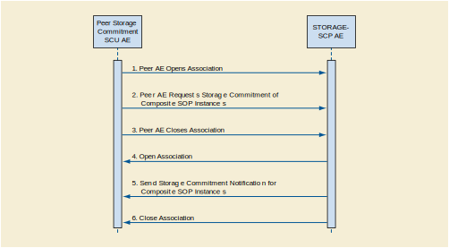
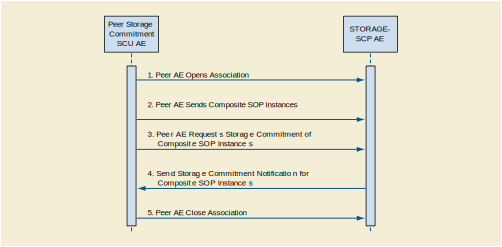

Storage Application Entity Specification
^^^^^^^^^^^^^^^^^^^^^^^^^^^^^^^^^^^^^^^^

.. _storage-sop-classes:

SOP Classes
"""""""""""

The Storage Application Entity provides Standard Conformance to the following SOP Class(es) :

.. csv-table:: Table 4.2.1.1-1.: SOP Classes for Storage Application Entity (SCP)
   :header: "SOP Class Group / SOP Class Name", "SOP Class UID", "SCU", "SCP"
   :file: sop-classes.csv

These are the default SOP Classes supported. By altering the configuration it is possible to support additional or fewer SOP Classes.

.. _storage-association-policies:

Association Policies
""""""""""""""""""""

.. _storage-general:

General
'''''''
The STORAGE-SCP AE can both accept and propose Association Requests. The STORAGE-SCP AE will accept Association Requests for the Verification, Storage, and Storage Commitment Push Model Services. It will propose Associations only for the Storage Commitment Push Model Service.
The DICOM standard Application Context Name for DICOM 3.0 is always accepted and proposed:

.. csv-table:: Table 4.2.1.2-1.: DICOM Application Context for STORAGE-SCP AE
   :file: common/storage-query-retrieve-workflow-general.csv

.. _storage-number-of-associations:

Number of Associations
''''''''''''''''''''''

The STORAGE-SCP AE can support multiple simultaneous Associations requested by peer AEs. Each time the STORAGE-SCP AE receives an Association, a child process will be spawned to process the Verification, Storage, or Storage Commitment Push Model Service requests. The maximum number of child processes, and thus the maximum number of simultaneous Associations that can be processed, is set by configuration. The default maximum number is 10 in total. This maximum number of simultaneous Associations can be either an absolute number or a maximum number for each requesting external Application Entity. The latter flexibility can be useful if communication with one external AE is unreliable and one does not wish 'hung' connections with this AE to prevent Associations with other client AEs.
The STORAGE-SCP AE initiates one Association at a time for sending Storage Commitment Push Model N-EVENT-REPORTs to peer AEs.

.. csv-table:: Table 4.2.1.2-2.: Number of Simultaneous Associations as an SCP for STORAGE-SCP AE
   :file: number-of-associations.csv

.. _storage-asynchrounous-nature:

Asynchronous Nature
'''''''''''''''''''

The STORAGE-SCP AE does not support asynchronous communication (multiple outstanding transactions over a single Association). The STORAGE-SCP AE does permit an SCU to send multiple Storage Commitment Push Model Requests before it has sent back any N-EVENT-REPORT Notifications. However, the STORAGE-SCP AE must send an N-ACTION Response before permitting another N-ACTION Request to be received so the DICOM communication itself is not truly asynchronous.

.. csv-table:: Table 4.2.1.2-3.: Asynchronous Nature as a SCP for STORAGE-SCP AE
   :file: asynchronous-nature.csv

There is no limit on the number of outstanding Storage Commitment Push Model Requests that can be received and acknowledged before the STORAGE-SCP AE has responded with the corresponding N-EVENT-REPORT Notifications.

.. csv-table:: Table 4.2.1.2-4.: Outstanding Storage Commitment Push Model Requests for STORAGE-SCP AE
   :file: outstanding-stgcmt-push-model-req.csv

.. _storage-implementation-class-uid:

Implementation Identifying Information
''''''''''''''''''''''''''''''''''''''

The implementation information for this Application Entity is:

.. csv-table:: Table 4.2.1.2-5.: DICOM Implementation Class and Version for STORAGE-SCP AE
   :file: common/storage-query-retrieve-implementation-identifying-information.csv

Note that the STORAGE-SCP AE specifies a different Implementation Class UID than that used by the other Application Entities. All DCM4CHEE archive AEs use the same Implementation Version Name. This Version Name is updated with each new release of the product software, as the different AE versions are never released independently.

.. _storage-association-initiation:

Association Initiation Policies
"""""""""""""""""""""""""""""""

.. _send-stgcmt-result:

Activity - Send Storage Commitment Notification Over New Association
''''''''''''''''''''''''''''''''''''''''''''''''''''''''''''''''''''

.. _send-stgcmt-result-seq:

Description and Sequencing of Activity
......................................

The STORAGE-SCP AE will initiate a new Association if a Storage Commitment Push Model Notification (N-EVENT-REPORT) cannot be sent back over the original Association used to send the corresponding request. A new Association will always be requested by the STORAGE-SCP AE in such cases even if the peer AE requests another Association after the original has been closed (i.e., A peer AE opens an Association and sends some Storage requests and a Storage Commitment Push Model request. Before the STORAGE-SCP AE can send the Storage Commitment Push Model N-EVEN-REPORT the Association is closed. The peer AE then opens another Association and begins to send Storage requests. In such a case the STORAGE-SCP AE will always initiate a new Association to send the N-EVENT-REPORT even though it could send the N-EVENT-REPORT over the new Association opened by the peer AE).
An Association Request is sent to the peer AE that sent the Storage Commitment Push Model request and upon successful negotiation of the required Presentation Context the outstanding N-EVENT-REPORT is sent. If there are multiple outstanding N-EVENT-REPORTs to be sent to a single peer AE then the STORAGE-SCP AE will attempt to send them all over a single Association rather than requesting a new Association for each one. The Association will be released when all the N-EVENT-REPORTs for the peer AE have been sent. If any type of error occurs during transmission (either a communication failure or indicated by a Status Code returned by the peer AE) over an open Association then the transfer of N-EVENT-REPORTs is halted. A new Association will be opened to retry sending outstanding N-EVENT-REPORTs. The maximum number of times the STORAGE-SCP AE will attempt to resend an N-EVENT-REPORT is configurable, along with the amount of time to wait between attempts to resend.
If the STORAGE-SCP AE sends a Notification request (N-EVENT-REPORT-RQ) over the original Association opened by the peer AE but receives a request to close the Association rather than a response to the Notification (N-EVENT-REPORT-RSP) then this is handled in the same way as if the request to close the Association had been received before trying to send the Notification request. Thus, the STORAGE-SCP AE will then open a new Association to resend the Notification request.
The STORAGE-SCP AE can be configured to always open a new Association before sending a Storage Commitment Push Model Notifications (N-EVENT-REPORT), in which case the sequencing illustrated in figure below will always be followed.

   Figure : Sequencing of Activity - Send Storage Commitment Notification Over New Association

The following sequencing constraints illustrated in figure above apply to the STORAGE-SCP AE for handling Storage Commitment Push Model Requests using a new Association:

1. Peer AE opens an Association with the STORAGE-SCP AE.
2. Peer AE requests Storage Commitment of Composite SOP Instance(s) (peer sends N-ACTION-RQ and STORAGE-SCP AE responds with N-ACTION-RSP to indicate that it received the request).
3. Peer AE closes the Association before the STORAGE-SCP AE can successfully send the Storage Commitment Push Model Notification (N-EVENT-REPORT-RQ).
4. STORAGE-SCP AE opens an Association with the peer AE.
5. STORAGE-SCP AE sends Storage Commitment Push Model Notification (N-EVENT-REPORT). More than one can be sent over a single Association if multiple Notifications are outstanding.
6. STORAGE-SCP AE closes the Association with the peer AE.

The Verification Service as an SCU is only supported as a utility function for Service staff. It is used only as a diagnostic tool when the STORAGE-SCP AE is failing to open new Associations to send N-EVENT-REPORTs to peer AEs.

.. _send-stgcmt-result-proposed-pcs:

Proposed Presentation Contexts
..............................

The Storage Application Entity will propose Presentation Contexts for Verification and the Storage Commitment Push Model SOP Class.
The list of proposed Transfer Syntaxes for the Storage Commitment Push Model SOP Class is configurable. By default, only the
Transfer Syntax Implicit VR Little Endian will be proposed.

.. table:: Table 4.2.1.3-1.: Proposed Presentation Contexts of Storage Application Entity by default configuration

+---------------------------------------------------------------------------------------------------------------------------+
| Presentation Context Table                                                                                                |
+------------------------------------------------------+---------------------------+---------------------+------+-----------+
| Abstract Syntax                                      | Transfer Syntax                                 | Role | Ext. Neg. |
+-------------------------------+----------------------+---------------------------+---------------------+      |           |
| Name                          | UID                  | Name                      | UID                 |      |           |
+===============================+======================+===========================+=====================+======+===========+
| Verification                  | 1.2.840.10008.1.1    | Implicit VR Little Endian | 1.2.840.10008.1.2   | SCU  | None      |
+-------------------------------+----------------------+---------------------------+---------------------+------+-----------+
| Storage Commitment Push Model | 1.2.840.10008.1.20.1 | Implicit VR Little Endian | 1.2.840.10008.1.2   | SCP  | None      |
+-------------------------------+----------------------+---------------------------+---------------------+------+-----------+

.. _stgcmt-conformance:

SOP Specific Conformance for Storage Commitment Push Model SOP Class
....................................................................

The associated Activity with the Storage Commitment Push Model service is the communication by the STORAGE-SCP AE to peer AEs that it has committed to permanently store Composite SOP Instances that have been sent to it. It thus allows peer AEs to determine whether the DCM4CHEE archive has taken responsibility for the archiving of specific SOP Instances so that they can be flushed from the peer AE system.

The STORAGE-SCP AE will initiate a new Association to a peer AE that sent a Storage Commitment Push Model request if the original Association over which this was sent is no longer open. For a detailed explanation of the SOP specific Behavior of the STORAGE-SCP AE in this case please refer to 4.2.4.4.1.3.3, Storage Commitment Push Model as an SCP.

.. _stgcmt-conformance-verification:

SOP Specific Conformance for Storage Commitment Verification SOP Class
......................................................................

Standard conformance is provided to the DICOM Verification Service Class as an SCU. The Verification Service as an SCU is actually only supported as a diagnostic service tool for network communication issues. It can be used to test whether Associations can actually be opened with a peer AE that is issuing Storage Commitment Push Model requests (i.e., to test whether the indicated TCP/IP port and AE Title for sending N-EVENT-REPORT Requests to the peer AE are truly functional).

.. _storage-association-acceptance:

Association Acceptance Policy
"""""""""""""""""""""""""""""

.. _storage-receive-stgcmt-rq:

Activity - Receive Images and Storage Commitment Requests
'''''''''''''''''''''''''''''''''''''''''''''''''''''''''

.. _storage-receive-stgcmt-rq-seq:

Description and Sequencing of Activities
........................................

The STORAGE-SCP AE accepts Associations only if they have valid Presentation Contexts. If none of the requested Presentation Contexts are accepted then the Association Request itself is rejected. It can be configured to only accept Associations with certain hosts (using TCP/IP address) and/or Application Entity Titles.
The default behavior of the STORAGE-SCP AE is to always attempt to send a Storage Commitment Push Model Notification (N-EVENT-REPORT) over the same Association opened by the peer AE to send the request (N-ACTION). If the STORAGE-SCP AE receives a request to close the Association either before sending the Notification or before receiving the corresponding N-EVENT-REPORT-RSP then it will open a new Association to send the Notification. Refer to Section F.4.2.3.4.1.5 for the details.

   Figure : Sequencing of Activity - Receive Images and Storage Commitment Requests

The following sequencing constraints illustrated in figure above apply to the STORAGE-SCP AE for handling Storage Commitment Push Model Requests over the original Association:

1. Peer AE opens an Association with the STORAGE-SCP AE.
2. Peer AE sends zero or more Composite SOP Instances.
3. Peer AE requests Storage Commitment of Composite SOP Instance(s) (peer sends N-ACTION-RQ and STORAGE-SCP AE responds with N-ACTION-RSP to indicate that it received the request).
4. STORAGE-SCP AE sends Storage Commitment Push Model Notification request (N-EVENT-REPORT-RQ) and successfully receives Notification response (N-EVENT-REPORT-RSP) from peer AE.
5. Peer AE closes the Association.

If the STORAGE-SCP AE receives a request to close the Association from the peer AE before sending the Notification request (N-EVENT-REPORT-RQ) or when expecting to receive a Notification response (N-EVENT-REPORT-RSP) then it will open a new Association to send (or resend) the Notification. Refer to 0 for the details. The STORAGE-SCP AE has a configurable timeout value for the maximum amount of time that it will wait on an open Association for a new request from a peer AE. A peer AE can reset this timer by sending a Verification request (C-ECHO-RQ). This can act as a useful mechanism for a peer AE to maintain an active Association if the length of time between sending Storage or Storage Commitment requests can be long (such as when using a single Association to send images as they are acquired during an ultrasound exam).
The STORAGE-SCP AE may reject Association attempts as shown in the Table below. The Result, Source and Reason/Diag columns represent the values returned in the corresponding fields of an ASSOCIATE-RJ PDU. The following abbreviations are used in the Source column:

a. 1 - DICOM UL service-user
b. 2 - DICOM UL service-provider (ASCE related function)
c. 3 - DICOM UL service-provider (Presentation related function)

.. csv-table:: Table 4.2.1.4.1-1.: Association Rejection Reasons
   :header: "Result", "Source", "Reason-Diag", "Explanation"
   :file: common/storage-query-retrieve-association-rejection-reasons.csv

.. _storage-receive-stgcmt-rq-accepted-pcs:

Accepted Presentation Contexts
..............................

The Storage Application Entity will accept Presentation Contexts for all SOP Classes listed in Table 4.2.1.1-1 by default.
The list of accepted Transfer Syntaxes for each accepted Abstract Syntax - as the list of accepted Abstract Syntaxes itselfs - is configurable.

.. table:: Table 4.2.1.4-1.: Accepted Presentation Contexts of Storage Application Entity by default configuration

+--------------------------------------------------------------------------------------------------------------------------------------+
| Presentation Context Table                                                                                                           |
+------------------------------------------------------+------------------------------------------------------------+------+-----------+
| Abstract Syntax                                      | Transfer Syntax                                            | Role | Ext. Neg. |
+-------------------------------+----------------------+----------------------------------+-------------------------+      |           |
| Name                          | UID                  | Name                             | UID                     |      |           |
+===============================+======================+==================================+=========================+======+===========+
| Verification                  | 1.2.840.10008.1.1    | Implicit VR Little Endian        | 1.2.840.10008.1.2       | SCP  | None      |
+-------------------------------+----------------------+----------------------------------+-------------------------+------+-----------+
| Storage Commitment Push Model | 1.2.840.10008.1.20.1 | Implicit VR Little Endian        | 1.2.840.10008.1.2       | SCP  | None      |
+-------------------------------+----------------------+----------------------------------+-------------------------+------+-----------+
| Any Image Storage SOP Class                          | Implicit VR Little Endian        | 1.2.840.10008.1.2       | SCP  | None      |
| listed in Table 4.2.1.1-1                            +----------------------------------+-------------------------+      |           |
|                                                      | Explicit VR Little Endian        | 1.2.840.10008.1.2.1     |      |           |
|                                                      +----------------------------------+-------------------------+      |           |
|                                                      | JPEG Baseline (Process 1)        | 1.2.840.10008.1.2.4.50  |      |           |
|                                                      +----------------------------------+-------------------------+      |           |
|                                                      | JPEG Extended (Process 2 & 4)    | 1.2.840.10008.1.2.4.51  |      |           |
|                                                      +----------------------------------+-------------------------+      |           |
|                                                      | JPEG Lossless, Non-Hierarchical, | 1.2.840.10008.1.2.4.54  |      |           |
|                                                      | (Process 14)                     |                         |      |           |
|                                                      +----------------------------------+-------------------------+      |           |
|                                                      | JPEG Lossless, Non-Hierarchical, | 1.2.840.10008.1.2.4.70  |      |           |
|                                                      | First-Order Prediction           |                         |      |           |
|                                                      | (Process 14 [Selection Value 1]) |                         |      |           |
|                                                      +----------------------------------+-------------------------+      |           |
|                                                      | JPEG-LS Lossless                 | 1.2.840.10008.1.2.4.80  |      |           |
|                                                      +----------------------------------+-------------------------+      |           |
|                                                      | JPEG-LS Lossy (Near-Lossless)    | 1.2.840.10008.1.2.4.81  |      |           |
|                                                      +----------------------------------+-------------------------+      |           |
|                                                      | RLE Lossless                     | 1.2.840.10008.1.2.5     |      |           |
+------------------------------------------------------+----------------------------------+-------------------------+------+-----------+
| Any Video Storage SOP Class                          | JPEG Baseline (Process 1)        | 1.2.840.10008.1.2.4.50  | SCP  | None      |
| listed in Table 4.2.1.1-1                            +----------------------------------+-------------------------+      |           |
|                                                      | MPEG2 Main Profile @ Main Level  | 1.2.840.10008.1.2.4.100 |      |           |
|                                                      +----------------------------------+-------------------------+      |           |
|                                                      | MPEG2 Main Profile @ High Level  | 1.2.840.10008.1.2.4.101 |      |           |
|                                                      +----------------------------------+-------------------------+      |           |
|                                                      | MPEG-4 AVC/H.264                 | 1.2.840.10008.1.2.4.102 |      |           |
|                                                      | High Profile / Level 4.1         |                         |      |           |
|                                                      +----------------------------------+-------------------------+      |           |
|                                                      | MPEG-4 AVC/H.264 BD-compatible   | 1.2.840.10008.1.2.4.103 |      |           |
|                                                      | High Profile / Level 4.1         |                         |      |           |
|                                                      +----------------------------------+-------------------------+      |           |
|                                                      | MPEG-4 AVC/H.264                 | 1.2.840.10008.1.2.4.104 |      |           |
|                                                      | High Profile / Level 4.2         |                         |      |           |
|                                                      | For 2D Video                     |                         |      |           |
|                                                      +----------------------------------+-------------------------+      |           |
|                                                      | MPEG-4 AVC/H.264                 | 1.2.840.10008.1.2.4.105 |      |           |
|                                                      | High Profile / Level 4.2         |                         |      |           |
|                                                      | For 3D Video                     |                         |      |           |
|                                                      +----------------------------------+-------------------------+      |           |
|                                                      | MPEG-4 AVC/H.264 Stereo          | 1.2.840.10008.1.2.4.106 |      |           |
|                                                      | High Profile / Level 4.2         |                         |      |           |
+------------------------------------------------------+----------------------------------+-------------------------+------+-----------+
| Any Structured Report Storage SOP Class              | Implicit VR Little Endian        | 1.2.840.10008.1.2       | SCP  | None      |
| listed in Table 4.2.1.1-1                            +----------------------------------+-------------------------+      |           |
|                                                      | Explicit VR Little Endian        | 1.2.840.10008.1.2.1     |      |           |
|                                                      +----------------------------------+-------------------------+      |           |
|                                                      | Deflated Explicit VR             | 1.2.840.10008.1.2.1.99  |      |           |
|                                                      | Little Endian                    |                         |      |           |
+------------------------------------------------------+----------------------------------+-------------------------+------+-----------+
| Any Other Storage SOP Class                          | Implicit VR Little Endian        | 1.2.840.10008.1.2       | SCP  | None      |
| listed in Table 4.2.1.1-1                            +----------------------------------+-------------------------+      |           |
|                                                      | Explicit VR Little Endian        | 1.2.840.10008.1.2.1     |      |           |
+------------------------------------------------------+----------------------------------+-------------------------+------+-----------+

If multiple Transfer Syntaxes are proposed per Presentation Context the order of Transfer Syntax preference is defined by the order
in the proposed Presentation Context.

.. _storage-verification-sop-conformance:

SOP Specific Conformance for Verification SOP Class
...................................................

The Storage Application Entity provides standard conformance to the Verification SOP Class as an SCP.

.. _storage-sop-conformance:

SOP Specific Conformance for Storage SOP Class
..............................................

The associated Activity with the Storage service is the storage of medical image data received over the network on a designated hard disk.
The Storage Application Entity will return a failure status if it is unable to store the images on to the hard disk.

The Storage Application Entity does not have any dependencies on the number of Associations used to send images to it. Images belonging to
more than one Study or Series can be sent over a single or multiple Associations. Images belonging to a single Study or Series can also be
sent over different Associations. There is no limit on either the number of SOP Instances or the maximum amount of total SOP Instance data
that can be transferred over a single Association.

The Storage Application Entity retains the original DICOM data in DICOM Part 10 compliant file format. The Storage Application Entity is 
Level 2 (Full) conformant as a Storage SCP. In addition, all Private and SOP Class Extended Elements are maintained in the DICOM format
files.

In addition to saving all Elements in files, a subset of the Elements are stored in the archive database to support query and retrieval
requests and also allow updating of Patient, Study, and Series information by user input, or demographic and Study related messages.

The behavior for handling duplicate SOP Instances is configurable by selecting one from 5 available Overwrite Policies:

NEVER:
  Never overwrite stored Instances on receive of a different Instance with equal SOP Instance UID. Ignore the received instance silently
  - returning a success status. 

ALWAYS:
  Always overwrite stored Instances by subsequently received Instances with equal SOP Instance UID.

SAME_SOURCE:
  Only overwrite stored Instances by subsequently received Instances with equal SOP Instance UID, if the new Instance was sent from the same
  Source Application Entity or HTTP client as the previous received Instance. Otherwise ignore the received instance silently -
  returning a success status.

SAME_SERIES:
  Only overwrite stored Instances by subsequently received Instances with equal SOP Instance UID, if the new Instance belongs to the same
  Series as the previous received Instance (= if beside the SOP Instance UID, also Study and Series Instance UID are equal). Otherwise
  ignore the received instance silently - returning a success status.

SAME_SOURCE_AND_SERIES:
  Only overwrite stored Instances by subsequently received Instances with equal SOP Instance UID, if the new Instance was sent from the same
  Source Application Entity or HTTP client as the previous received Instance, and if the new Instance belongs to the same Series as the
  previous received Instance (= if beside the SOP Instance UID, also Study and Series Instance UID are equal). Otherwise ignore the received
  instance silently - returning a success status.

By default, Overwrite Policy: SAME_SOURCE is configured.

The Storage Application Entity can be configured to compress uncompressed received Image SOP Instances, dependent on the Source Application
Entity or HTTP client and dependent of DICOM Attribute values of received SOP Instances, using one of following Transfer Syntaxes:

..table:: Table 4.2.1.4.4-1.: Supported Transfer Syntaxes for Image Compression by Storage Application Entity

+------------------------------------------------------------+
| Transfer Syntax                                            |
+----------------------------------+-------------------------+
| Name                             | UID                     |
+==================================+=========================+
| JPEG Baseline (Process 1)        | 1.2.840.10008.1.2.4.50  |
+----------------------------------+-------------------------+
| JPEG Extended (Process 2 & 4)    | 1.2.840.10008.1.2.4.51  |
+----------------------------------+-------------------------+
| JPEG Lossless, Non-Hierarchical, | 1.2.840.10008.1.2.4.70  |
| First-Order Prediction           |                         |
| (Process 14 [Selection Value 1]) |                         |
+----------------------------------+-------------------------+
| JPEG-LS Lossless                 | 1.2.840.10008.1.2.4.80  |
+----------------------------------+-------------------------+

By default, no image compression is configured.

.. csv-table:: Table 4.2.1.4.4-2.: Storage Application C-STORE Response Status Return Reasons
   :header: "Service Status", "Further Meaning", "Error Code", "Behaviour"
   :file: c-store-response-status-return-reasons.csv

Note : If a failure condition does occur when handling an Association then all images previously received successfully over the Association
are maintained in the DCM4CHEE archive database. No previously successfully received images are discarded. Even if an image is successfully
received but an error occurs transmitting the C-STORE Response then this final image is maintained rather than discarded. If the loss of an
Association is detected then the Association is closed.
The Behavior of STORAGE-SCP AE during communication failure is summarized in the following table:

.. csv-table:: Table 4.2.1.4.4-2.: STORAGE-SCP AE Storage Service Communication Failure Reasons
   :header: "Exception", "Reason"
   :file: storage-scp-communication-failure-reasons.csv

.. _storage-stgcmt-conformance:

SOP Specific Conformance for Storage Commitment SOP Class
.........................................................

The associated Activity with the Storage Commitment Push Model service is the communication by the STORAGE-SCP AE to peer AEs that it has committed to permanently store Composite SOP Instances that have been sent to it. It thus allows peer AEs to determine whether the DCM4CHEE archive has taken responsibility for the archiving of specific SOP Instances so that they can be flushed from the peer AE system.
The STORAGE-SCP AE takes the list of Composite SOP Instance UIDs specified in a Storage Commitment Push Model N-ACTION Request and checks if they are present in the DCM4CHEE archive database. As long as the Composite SOP Instance UIDs are present in the database, the STORAGE-SCP AE will consider those Composite SOP Instance UIDs to be successfully archived. The STORAGE-SCP AE does not require the Composite SOP Instances to actually be successfully written to archive media in order to commit to responsibility for maintaining these SOP Instances.
Once the STORAGE-SCP AE has checked for the existence of the specified Composite SOP Instances, it will then attempt to send the Notification request (N-EVENT-REPORT-RQ). The default behavior is to attempt to send this Notification over the same Association that was used by the peer AE to send the original N-ACTION Request. If the Association has already been released or Message transfer fails for some reason then the STORAGE-SCP AE will attempt to send the N-EVENT-REPORT-RQ over a new Association. The STORAGE-SCP AE will request a new Association with the peer AE that made the original N-ACTION Request. The STORAGE-SCP AE can be configured to always open a new Association in order to send the Notification request.
The STORAGE-SCP AE will not cache Storage Commitment Push Model N-ACTION Requests that specify Composite SOP Instances that have not yet been transferred to the DCM4CHEE archive. If a peer AE sends a Storage Commitment Push Model N-ACTION Request before the specified Composite SOP Instances are later sent over the same Association, the STORAGE-SCP AE will not commit to responsibility for such SOP Instances.
The STORAGE-SCP AE does not support the optional Storage Media File-Set ID & UID attributes in the N-ACTION.
The DCM4CHEE archive never automatically deletes Composite SOP Instances from the archive. The absolute persistence of SOP Instances and the maximum archiving capacity for such SOP Instances is dependent on the archiving media and capacity used by the DCM4CHEE archive and is dependent on the actual specifications of the purchased system. It is necessary to check the actual system specifications to determine these characteristics.
The STORAGE-SCP AE will support Storage Commitment Push Model requests for SOP Instances of any of the Storage SOP Classes that are also supported by the STORAGE-SCP AE:

.. csv-table:: Table 4.2.1.4.5-1.: Supported Referenced SOP Classes in Storage Commitment Push Model N-ACTION Requests
   :header: "Supported Referenced SOP Classes"
   :file: supported-sop-classes-stgcmt.csv

The STORAGE-SCP AE will return the following Status Code values in N-ACTION Responses:

.. csv-table:: Table 4.2.1.4.5-2.: STORAGE-SCP AE Storage Commitment Push Model N-ACTION Response Status Return Behavior
   :header: "Service Status", "Further Meaning", "Error Code", "Behaviour"
   :file: stgcmt-n-action-response-status-return-behaviour.csv

The STORAGE-SCP AE will exhibit the following Behavior according to the Status Code value returned in an N-EVENT-REPORT Response from a destination Storage Commitment Push Model SCU:

.. csv-table:: Table 4.2.1.4.5-3.: STORAGE-SCP AE N-EVENT-REPORT Response Status Handling Behavior
   :header: "Service Status", "Further Meaning", "Error Code", "Behaviour"
   :file: stgcmt-n-event-response-status-return-behaviour.csv

All Status Codes indicating an error or refusal are treated as a permanent failure. The STORAGE-SCP AE can be configured to automatically reattempt the sending of Storage Commitment Push Model N-EVENT-REPORT Requests if an error Status Code is returned or a communication failure occurs. The maximum number of times to attempt sending as well as the time to wait between attempts is configurable.

.. csv-table:: Table 4.2.1.4.5-4.: STORAGE-SCP AE Storage Commitment Push Model Communication Failure Behavior
   :header: "Exception", "Behaviour"
   :file: stgcmt-communication-failure-behaviour.csv
