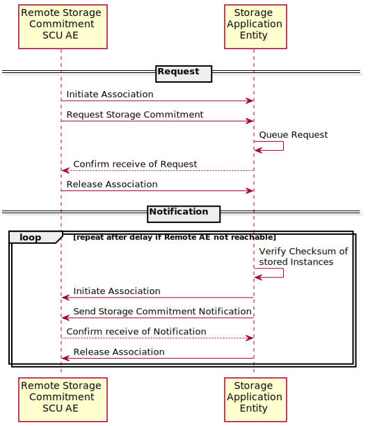

Storage Application Entity Specification
^^^^^^^^^^^^^^^^^^^^^^^^^^^^^^^^^^^^^^^^

.. _storage-sop-classes:

SOP Classes
"""""""""""

The Storage Application Entity provides Standard Conformance to the following SOP Class(es) :

.. csv-table:: SOP Classes for Storage Application Entity (SCP)
   :name: SOPClasses
   :header: "SOP Class Name", "SOP Class UID", "SCU", "SCP"
   :file: sop-classes.csv

These are the default SOP Classes supported. By altering the configuration it is possible to support additional or fewer SOP Classes.

.. _storage-association-policies:

Association Policies
""""""""""""""""""""

.. _storage-general:

General
'''''''
The Storage Application Entity can both accept and propose Association Requests. The Storage Application Entity will
accept Association Requests for the Verification, Storage, and Storage Commitment Push Model Services. It will propose
Associations only for the Storage Commitment Push Model Service.

The DICOM standard Application Context Name for DICOM 3.0 is always accepted and proposed:

.. csv-table:: DICOM Application Context for Storage Application Entity

  "Application Context Name", "1.2.840.10008.3.1.1.1"

.. _storage-number-of-associations:

Number of Associations
''''''''''''''''''''''

The Storage Application Entity can support multiple simultaneous Associations requested by peer AEs.
The maximum total number of simultaneous Associations accepted from peer AEs is configurable. It is unlimited by default.

The Storage Application Entity initiates up to 5 Associations at a time for sending Storage Commitment Push Model
N-EVENT-REPORTs to peer AEs.

.. csv-table:: Number of Simultaneous Associations as an SCP for the Storage Application Entity

   "Maximum number of simultaneous Associations requested by peer AEs", "No Maximum Limit (Configurable)"
   "Maximum number of simultaneous Associations initiated by the Storage Application Entity", "5"

.. _storage-asynchrounous-nature:

Asynchronous Nature
'''''''''''''''''''

The Storage Application Entity supports asynchronous communication (multiple outstanding transactions over a single Association).
The maximum number of outstanding asynchronous transactions is configurable. It is unlimited by default.

.. csv-table:: Asynchronous Nature as a SCP for the Storage Application Entity

   "Maximum number of outstanding asynchronous transactions", "No Maximum Limit (Configurable)"

There is no limit on the number of outstanding Storage Commitment Push Model Requests that can be received and
acknowledged before the Storage Application Entity has responded with the corresponding N-EVENT-REPORT Notifications.

.. _storage-implementation-class-uid:

Implementation Identifying Information
''''''''''''''''''''''''''''''''''''''

The implementation information for the Storage Application Entity is:

.. csv-table:: DICOM Implementation Class and Version for the Storage Application Entity

   "Implementation Class UID", "1.2.40.0.13.1.3"
   "Implementation Version Name", "dcm4che-5.xx.yy"

All Application Entities of |product| use the same Implementation Version Name. This Version Name is updated with each
new release of the product software.

.. _storage-association-initiation:

Association Initiation Policies
"""""""""""""""""""""""""""""""

Activity - Send Storage Commitment Notification Over New Association
''''''''''''''''''''''''''''''''''''''''''''''''''''''''''''''''''''

Description and Sequencing of Activity
......................................

The Storage Application Entity does not support to send the Storage Commitment Notification over the same Association
over which it received the Storage Commitment Push Model (N-ACTION) request from the remote AE. It always initiates a
new Association to the remote AE that sent the Storage Commitment Push Model request for sending the corresponding
Storage Commitment Notification (N-EVENT-REPORT).

If any type of error occurs during transmission (either a communication failure or indicated by a Status Code returned
by the remote AE), the Storage Application Entity will attempt to resend an N-EVENT-REPORT. The maximum number of
attempts to resend an N-EVENT-REPORT is configurable, along with the amount of time to wait between attempts to
resend.

   Remote AE Requests Storage Commitment

Proposed Presentation Contexts
..............................

The Storage Application Entity will propose Presentation Contexts for the Storage Commitment Push Model SOP Class.
The list of proposed Transfer Syntaxes for the Storage Commitment Push Model SOP Class is configurable. By default,
only the Transfer Syntax Implicit VR Little Endian will be proposed.

.. table:: Proposed Presentation Contexts of Storage Application Entity by default configuration

   +---------------------------------------------------------------------------------------------------------------------------+
   | Presentation Context Table                                                                                                |
   +------------------------------------------------------+---------------------------+---------------------+------+-----------+
   | Abstract Syntax                                      | Transfer Syntax                                 | Role | Ext. Neg. |
   +-------------------------------+----------------------+---------------------------+---------------------+      |           |
   | Name                          | UID                  | Name                      | UID                 |      |           |
   +===============================+======================+===========================+=====================+======+===========+
   | Storage Commitment Push Model | 1.2.840.10008.1.20.1 | Implicit VR Little Endian | 1.2.840.10008.1.2   | SCP  | None      |
   +-------------------------------+----------------------+---------------------------+---------------------+------+-----------+

.. _stgcmt-conformance:

SOP Specific Conformance for Storage Commitment Push Model SOP Class
....................................................................

The Storage Application Entity only accepts Storage Commitment Push Model N-ACTION Requests from Remote AEs which
AE Title is configured.

The Storage Application Entity takes the list of Composite SOP Instance UIDs specified in a Storage Commitment Push
Model N-ACTION Request and checks if they are present in the database. Each present Composite SOP Instance will be
fetched from the storage recalculating its checksum. The Storage Application Entity will only commit to responsibility
for SOP Instances which recalculated checksum matches the value from the database, which was calculated on receive of
the SOP Instance.

Once the Storage Application Entity has checked for the existence and matching of the checksum of the specified
Composite SOP Instances, it will then attempt to send the Notification request (N-EVENT-REPORT-RQ) over a new
Association. The Storage Application Entity will request a new Association with the peer AE that made the original
N-ACTION Request.

The Storage Application Entity will not cache Storage Commitment Push Model N-ACTION Requests that specify
Composite SOP Instances that have not yet been transferred to |product|. If a remote AE sends a Storage Commitment Push
Model N-ACTION Request before the specified Composite SOP Instances, the Storage Application Entity will not commit to
responsibility for such SOP Instances.

The amount of time to take responsibility for the safekeeping of an objects is independent of the successful
commitment to store the object, but depends on other configuration options, particularly on the configured
*Study Retention Policy*. It is even possible to accept storage commitment requests when acting as a cache archive,
which deletes least recent accessed studies according configured thresholds of the storage backend.

The Storage Application Entity does not support the optional Storage Media File-Set ID & UID attributes in the N-ACTION
and in the N-EVENT-REPORT.

The Storage Application Entity supports the optional Retrieve AE Title (0008,0054) Attribute in the N-EVENT-REPORT.

The Storage Application Entity supports Storage Commitment Push Model requests for SOP Instances of any Storage SOP Class.

.. _storage-association-acceptance:

Association Acceptance Policy
"""""""""""""""""""""""""""""

.. _storage-receive-stgcmt-rq:

Activity - Receive Images and Storage Commitment Requests
'''''''''''''''''''''''''''''''''''''''''''''''''''''''''

.. _storage-receive-stgcmt-rq-seq:

Description and Sequencing of Activities
........................................

The Storage Application Entity can be configured to only accept Associations with certain hosts (using TCP/IP address)
and/or Application Entity Titles.

.. _storage-receive-stgcmt-rq-accepted-pcs:

Accepted Presentation Contexts
..............................

The Storage Application Entity will accept Presentation Contexts for all SOP Classes listed in Table 4.2.1.1-1 by default.
The list of accepted Transfer Syntaxes for each accepted Abstract Syntax - as the list of accepted Abstract Syntaxes itselfs - is configurable.

.. table:: Accepted Presentation Contexts of Storage Application Entity by default configuration

   +---------------------------------------------------------------------------------------------------------------------------------------+
   | Presentation Context Table                                                                                                            |
   +------------------------------------------------------+-------------------------------------------------------------+------+-----------+
   | Abstract Syntax                                      | Transfer Syntax                                             | Role | Ext. Neg. |
   +-------------------------------+----------------------+------------------------------------+------------------------+      |           |
   | Name                          | UID                  | Name                               | UID                    |      |           |
   +===============================+======================+====================================+========================+======+===========+
   | Verification                  | 1.2.840.10008.1.1    | Implicit VR Little Endian          | 1.2.840.10008.1.2      | SCP  | None      |
   +-------------------------------+----------------------+------------------------------------+------------------------+------+-----------+
   | Storage Commitment Push Model | 1.2.840.10008.1.20.1 | Implicit VR Little Endian          | 1.2.840.10008.1.2      | SCP  | None      |
   +-------------------------------+----------------------+------------------------------------+------------------------+------+-----------+
   | Image Storage SOP Classes in :ref:`SOPClasses`       | see :ref:`SCPImageTS`                                       | SCP  | None      |
   +------------------------------------------------------+-------------------------------------------------------------+------+-----------+
   | Video Storage SOP Classes in :ref:`SOPClasses`       | see :ref:`SCPVideoTS`                                       | SCP  | None      |
   +------------------------------------------------------+-------------------------------------------------------------+------+-----------+
   | SR Storage SOP Classes in :ref:`SOPClasses`          | see :ref:`SCPStructuredReportTS`                            | SCP  | None      |
   +------------------------------------------------------+-------------------------------------------------------------+------+-----------+
   | Other Storage SOP Classes in :ref:`SOPClasses`       | see :ref:`SCPOtherTS`                                       | SCP  | None      |
   +------------------------------------------------------+-------------------------------------------------------------+------+-----------+

.. csv-table:: Transfer Syntaxes for Image Storage SOP Classes
   :name: SCPImageTS
   :header: "Transfer Syntax Name", "UID"

   "Implicit VR Little Endian", "1.2.840.10008.1.2"
   "Explicit VR Little Endian", "1.2.840.10008.1.2.1"
   "JPEG Baseline (Process 1)", "1.2.840.10008.1.2.4.50"
   "JPEG Extended (Process 2 & 4)", "1.2.840.10008.1.2.4.51"
   "JPEG Lossless, Non-Hierarchical (Process 14)", "1.2.840.10008.1.2.4.54"
   "JPEG Lossless, Non-Hierarchical, First-Order Prediction (Process 14 [Selection Value 1])", "1.2.840.10008.1.2.4.70"
   "JPEG-LS Lossless", "1.2.840.10008.1.2.4.80"
   "JPEG-LS Lossy (Near-Lossless)", "1.2.840.10008.1.2.4.81"
   "JPEG 2000 (Lossless Only) [#j2k1]_", "1.2.840.10008.1.2.4.90"
   "JPEG 2000 [#j2k1]_", "1.2.840.10008.1.2.4.91"
   "RLE Lossless", "1.2.840.10008.1.2.5"

.. [#j2k1] Because of known issues of the JPEG 2000 implementation, acceptance of JPEG 2000 is only recommended for production, if all
   Retrieve Destinations also accepts JPEG 2000, so the archive does not need to decompress JPEG 2000 images for retrieval.

.. csv-table:: Transfer Syntax for Video Storage SOP Classes
   :name: SCPVideoTS
   :header: "Transfer Syntax Name", "UID"

   "JPEG Baseline (Process 1)", "1.2.840.10008.1.2.4.50"
   "MPEG2 Main Profile @ Main Level", "1.2.840.10008.1.2.4.100"
   "MPEG2 Main Profile @ High Level", "1.2.840.10008.1.2.4.101"
   "MPEG-4 AVC/H.264 High Profile / Level 4.1", "1.2.840.10008.1.2.4.102"
   "MPEG-4 AVC/H.264 BD-compatible High Profile / Level 4.1", "1.2.840.10008.1.2.4.103"
   "MPEG-4 AVC/H.264 High Profile / Level 4.2 For 2D Video", "1.2.840.10008.1.2.4.104"
   "MPEG-4 AVC/H.264 High Profile / Level 4.2 For 3D Video", "1.2.840.10008.1.2.4.105"
   "MPEG-4 AVC/H.264 Stereo High Profile / Level 4.2", "1.2.840.10008.1.2.4.106"

.. csv-table:: Transfer Syntaxes for SR Storage SOP Classes
   :name: SCPStructuredReportTS
   :header: "Transfer Syntax Name", "UID"

   "Implicit VR Little Endian", "1.2.840.10008.1.2"
   "Explicit VR Little Endian", "1.2.840.10008.1.2.1"
   "Deflated Explicit VR Little Endian", "1.2.840.10008.1.2.1.99"

.. csv-table:: Transfer Syntaxes for Other Storage SOP Classes
   :name: SCPOtherTS
   :header: "Transfer Syntax Name", "UID"

   "Implicit VR Little Endian", "1.2.840.10008.1.2"
   "Explicit VR Little Endian", "1.2.840.10008.1.2.1"

If multiple Transfer Syntaxes are proposed per Presentation Context the order of Transfer Syntax preference is defined by the order
in the proposed Presentation Context.

.. _storage-verification-sop-conformance:

SOP Specific Conformance for Verification SOP Class
...................................................

The Storage Application Entity provides standard conformance to the Verification SOP Class as an SCP.

.. _storage-sop-conformance:

SOP Specific Conformance for Storage SOP Class
..............................................

The associated Activity with the Storage service is the storage of medical image data received over the network on a designated hard disk.
The Storage Application Entity will return a failure status if it is unable to store the images on to the hard disk.

The Storage Application Entity does not have any dependencies on the number of Associations used to send images to it. Images belonging to
more than one Study or Series can be sent over a single or multiple Associations. Images belonging to a single Study or Series can also be
sent over different Associations. There is no limit on either the number of SOP Instances or the maximum amount of total SOP Instance data
that can be transferred over a single Association.

The Storage Application Entity retains the original DICOM data in DICOM Part 10 compliant file format. The Storage Application Entity is 
Level 2 (Full) conformant as a Storage SCP. In addition, all Private and SOP Class Extended Elements are maintained in the DICOM format
files.

In addition to saving all Elements in files, a subset of the Elements are stored in the archive database to support query and retrieval
requests and also allow updating of Patient, Study, and Series information by user input, or demographic and Study related messages.

The behavior for handling duplicate SOP Instances is configurable by selecting one of 5 available Overwrite Policies:

NEVER:
  Never overwrite stored Instances on receive of a different Instance with equal SOP Instance UID. Ignore the received instance silently
  - returning a success status. 

ALWAYS:
  Always overwrite stored Instances by subsequently received Instances with equal SOP Instance UID.

SAME_SOURCE (default):
  Only overwrite stored Instances by subsequently received Instances with equal SOP Instance UID, if the new Instance was sent from the same
  Source Application Entity or HTTP client as the previous received Instance. Otherwise ignore the received instance silently -
  returning a success status.

SAME_SERIES:
  Only overwrite stored Instances by subsequently received Instances with equal SOP Instance UID, if the new Instance belongs to the same
  Series as the previous received Instance (= if beside the SOP Instance UID, also Study and Series Instance UID are equal). Otherwise
  ignore the received instance silently - returning a success status.

SAME_SOURCE_AND_SERIES:
  Only overwrite stored Instances by subsequently received Instances with equal SOP Instance UID, if the new Instance was sent from the same
  Source Application Entity or HTTP client as the previous received Instance, and if the new Instance belongs to the same Series as the
  previous received Instance (= if beside the SOP Instance UID, also Study and Series Instance UID are equal). Otherwise ignore the received
  instance silently - returning a success status.

The behavior for updating Patient, Study and Series Attributes in the archive database, if there values differs between received Instances of
the same Patient, Study and Series is configurable for each Entity Level by selecting one of 4 Attribute Update Policies:

NONE:
  Do not update the Attributes of the Entity in the database from its initial values extracted from the first received Instance of the Entity. 

SUPPLEMENT (default for Patient Attributes):
  Supplement the Attributes of the Entity in the database with Attributes of subsequently received Instances which were not present or had
  no value in previous received Instances of the same Entity.

MERGE (default for Study and Series Attributes):
  Overwrite the Attributes of the Entity in the database with non-empty Attributes from subsequently received Instances of the same Entity.

OVERWRITE: 
  Overwrite the Attributes of the Entity in the database with all Attributes from subsequently received Instances of the same Entity.

The Storage Application Entity can be configured to compress uncompressed received Image SOP Instances, dependent on the Source Application
Entity or HTTP client and dependent of DICOM Attribute values of received SOP Instances, using one of following Transfer Syntaxes:

.. csv-table:: Supported Transfer Syntaxes for Image Compression by Storage Application Entity
   :name: SCPImageCompressionTS
   :header: "Transfer Syntax Name", "UID"

   "JPEG Baseline (Process 1)", "1.2.840.10008.1.2.4.50"
   "JPEG Extended (Process 2 & 4)", "1.2.840.10008.1.2.4.51"
   "JPEG Lossless, Non-Hierarchical, First-Order Prediction (Process 14 [Selection Value 1])", "1.2.840.10008.1.2.4.70"
   "JPEG-LS Lossless", "1.2.840.10008.1.2.4.80"
   "JPEG 2000 (Lossless Only) [#j2k2]_", "1.2.840.10008.1.2.4.90"
   "JPEG 2000 [#j2k2]_", "1.2.840.10008.1.2.4.91"

.. [#j2k2] JPEG 2000 is not recommended for production because of known issues of the JPEG 2000 implementation

By default, no image compression is configured.

.. csv-table:: Storage Application C-STORE Response Status Return Reasons
    :header-rows: 1
    :widths: 10, 10, 5, 20, 20
    :file: c-store-response-status-return-reasons.csv

Note : If a failure condition does occur when handling an Association then all images previously received successfully over the Association
are maintained in the DCM4CHEE archive database. No previously successfully received images are discarded. Even if an image is successfully
received but an error occurs transmitting the C-STORE Response then this final image is maintained rather than discarded. If the loss of an
Association is detected then the Association is closed. In the above table, some references to rejection error codes in Refused Service
Status is due to the fact that, when objects are rejected the rejection notes are stored in the database for further processing.

The Behavior of Storage Application Entity during communication failure is summarized in the following table:

.. csv-table:: Storage Application Entity Storage Service Communication Failure Reasons
   :header: "Exception", "Reason"
   :file: storage-scp-communication-failure-reasons.csv

.. _storage-stgcmt-conformance:

SOP Specific Conformance for Storage Commitment SOP Class
.........................................................

The associated Activity with the Storage Commitment Push Model service is the communication by the Storage Application Entity to peer AEs that it has committed to permanently store Composite SOP Instances that have been sent to it. It thus allows peer AEs to determine whether the DCM4CHEE archive has taken responsibility for the archiving of specific SOP Instances so that they can be flushed from the peer AE system.
The Storage Application Entity takes the list of Composite SOP Instance UIDs specified in a Storage Commitment Push Model N-ACTION Request and checks if they are present in the DCM4CHEE archive database. As long as the Composite SOP Instance UIDs are present in the database, the Storage Application Entity will consider those Composite SOP Instance UIDs to be successfully archived. The Storage Application Entity does not require the Composite SOP Instances to actually be successfully written to archive media in order to commit to responsibility for maintaining these SOP Instances.
Once the Storage Application Entity has checked for the existence of the specified Composite SOP Instances, it will then attempt to send the Notification request (N-EVENT-REPORT-RQ). The default behavior is to attempt to send this Notification over the same Association that was used by the peer AE to send the original N-ACTION Request. If the Association has already been released or Message transfer fails for some reason then the Storage Application Entity will attempt to send the N-EVENT-REPORT-RQ over a new Association. The Storage Application Entity will request a new Association with the peer AE that made the original N-ACTION Request. The Storage Application Entity can be configured to always open a new Association in order to send the Notification request.
The Storage Application Entity will not cache Storage Commitment Push Model N-ACTION Requests that specify Composite SOP Instances that have not yet been transferred to the DCM4CHEE archive. If a peer AE sends a Storage Commitment Push Model N-ACTION Request before the specified Composite SOP Instances are later sent over the same Association, the Storage Application Entity will not commit to responsibility for such SOP Instances.
The Storage Application Entity does not support the optional Storage Media File-Set ID & UID attributes in the N-ACTION.
The DCM4CHEE archive never automatically deletes Composite SOP Instances from the archive. The absolute persistence of SOP Instances and the maximum archiving capacity for such SOP Instances is dependent on the archiving media and capacity used by the DCM4CHEE archive and is dependent on the actual specifications of the purchased system. It is necessary to check the actual system specifications to determine these characteristics.
The Storage Application Entity will support Storage Commitment Push Model requests for SOP Instances of any of the Storage SOP Classes that are also supported by the Storage Application Entity as given in 4.2.1.1-1.: SOP Classes for Storage Application Entity (SCP)

The Storage Application Entity will return the following Status Code values in N-ACTION Responses:

.. csv-table:: Storage Application Entity Storage Commitment Push Model N-ACTION Response Status Return Behavior
   :header: "Service Status", "Further Meaning", "Error Code", "Behaviour"
   :widths: 10, 10, 5, 20
   :file: stgcmt-n-action-response-status-return-behaviour.csv

The Storage Application Entity will exhibit the following Behavior according to the Status Code value returned in an N-EVENT-REPORT Response from a destination Storage Commitment Push Model SCU:

.. csv-table:: Storage Application Entity N-EVENT-REPORT Response Status Handling Behavior
   :header: "Service Status", "Further Meaning", "Error Code", "Behaviour"
   :widths: 10, 10, 5, 20
   :file: stgcmt-n-eventresponse-status-return-behaviour.csv

All Status Codes indicating an error or refusal are treated as a permanent failure. The Storage Application Entity can be configured to automatically reattempt the sending of Storage Commitment Push Model N-EVENT-REPORT Requests if an error Status Code is returned or a communication failure occurs. The maximum number of times to attempt sending as well as the time to wait between attempts is configurable.
