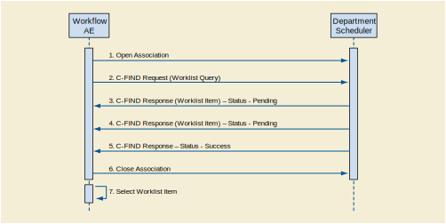
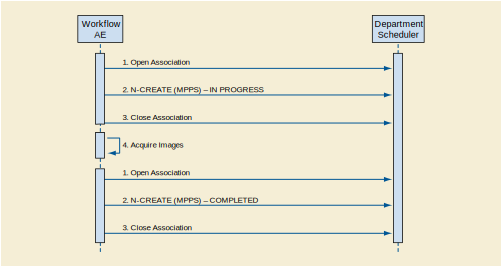

Workflow Application Entity Specification
^^^^^^^^^^^^^^^^^^^^^^^^^^^^^^^^^^^^^^^^^

.. _workflow-sop-classes:

SOP Classes
"""""""""""

The Workflow Application Entity provides Standard Conformance to the following SOP Class(es) :

.. csv-table:: SOP Classes for Workflow Application Entity (SCP)
   :header: "SOP Class Name", "SOP Class UID", "SCU", "SCP"
   :file: sop-classes.csv

.. _workflow-association-establishment:

Association Policies
""""""""""""""""""""

.. _workflow-general:

General
'''''''
The DICOM standard application context name for DICOM 3.0 is always proposed:

.. csv-table:: DICOM Application Context for AE Workflow
   :file: common/storage-query-retrieve-workflow-general.csv

.. _workflow-number-of-associations:

Number of Associations
''''''''''''''''''''''
The Workflow AE initiates one Association at a time for a Worklist request.

.. csv-table:: Number of Associations Initiated for AE Workflow
   :file: number-of-associations.csv

.. _workflow-asynchrounous-nature:

Asynchronous Nature
'''''''''''''''''''

The Workflow AE does not support asynchronous communication (multiple outstanding transactions over a single Association).

.. csv-table:: Asynchronous Nature as a SCU for STORAGE-SCU AE
   :file: asynchronous-nature.csv

.. _workflow-implementation-class-uid:

Implementation Identifying Information
''''''''''''''''''''''''''''''''''''''
The implementation information for this Application Entity is:

.. csv-table:: DICOM Implementation Class and Version for AE Workflow
   :file: implementation-identifying-information.csv

.. _workflow-association-initiation:

Association Initiation Policies
"""""""""""""""""""""""""""""""

.. _worklist-worklist-update:

Activity - Worklist Update
''''''''''''''''''''''''''

.. _worklist-worklist-update-seq:

Description and Sequencing of Activities
........................................

The request for a Worklist Update is initiated by user interaction, i.e., pressing the buttons "Worklist Update"/"Patient Worklist Query"
or automatically at specific time intervals, configurable by the user. With "Worklist Update" the automated query mechanism is performed
immediately on request, while with "Patient Worklist Query" a dialog to enter search criteria is opened and an interactive query can
be performed.
The interactive Patient Worklist Query will display a dialog for entering data as search criteria. When the Query is started on user request,
only the data from the dialog will be inserted as matching keys into the query.
With automated worklist queries (including "Worklist Update") the Worklist Application Entity always requests all items
for a Scheduled Procedure Step Start Date (actual date), Modality (RF) and Scheduled Station AE Title. Query for the Scheduled
Station AE Title is configurable by a Service Engineer.
Upon initiation of the request, the Worklist Application Entity will build an Identifier for the C-FIND request, will initiate an
Association to send the request and will wait for Worklist responses. After retrieval of all responses, Worklist Application Entity
will access the local database to add or update patient demographic data. To protect the system from overflow, the Worklist Application Entity will limit the number of processed worklist responses to a configurable maximum. During receiving
the worklist response items are counted and the query processing is canceled by issuing a C-FIND-CANCEL if the configurable limit
of items is reached. The results will be displayed in a separate list, which will be cleared with the next worklist update.
Worklist Application Entity will initiate an Association in order to issue a C-FIND request according to the Modality
Worklist Information Model.

   Figure : Sequencing of Activity - Worklist Update

A possible sequence of interactions between the Workflow AE and a Departmental Scheduler (e.g., a device such as a RIS or HIS
that supports the Modality Worklist SOP Class as an SCP) is illustrated in the Figure above:

1. The Worklist AE opens an association with the Departmental Scheduler
2. The Worklist AE sends a C-FIND request to the Departmental Scheduler containing the Worklist Query attributes.
3. The Departmental Scheduler returns a C-FIND response containing the requested attributes of the first matching Worklist Item.
4. The Departmental Scheduler returns another C-FIND response containing the requested attributes of the second matching
Worklist Item.
5. The Departmental Scheduler returns another C-FIND response with status Success indicating that no further matching Worklist
Items exist. This example assumes that only 2 Worklist items match the Worklist Query.
6. The Worklist AE closes the association with the Departmental Scheduler.
7. The user selects a Worklist Item from the Worklist and prepares to acquire new images.

After Patient registration, the Modality is awaiting the 1st application of X-Ray Dose to the patient. The trigger to create a MPPS SOP Instance is derived from this event. An Association to the configured MPPS SCP system is established immediately and the related MPPS SOP Instance will be created.
A manual update can be performed with the MPPS user interface where is it possible to set the final state of the MPPS to "COMPLETED" or "DISCONTINUED". In the "Discontinued" case the user can also select the discontinuation reason. A MPPS Instance that has been sent with a state of "COMPLETED" or "DISCONTINUED" can no longer be updated.
The Modality will support creation of "unscheduled cases" by allowing MPPS Instances to be communicated for locally registered Patients. The Modality only supports a 0-to-1 relationship between Scheduled and Performed Procedure Steps. The Modality will initiate an Association to issue an:

1. N-CREATE request according to the CREATE Modality Performed Procedure Step SOP Instance operation or a
2. N-SET request to update the contents and state of the MPPS according to the SET Modality Performed Procedure Step Information operation.

   Figure : Sequencing of Activity - Acquire Images

A possible sequence of interactions between the Workflow AE and a Departmental Scheduler (e.g., a device such as a RIS or HIS that supports the MPPS SOP Class as an SCP) is illustrated in above figure.

1. The Worklist AE opens an association with the Departmental Scheduler
2. The Worklist AE sends an N-CREATE request to the Departmental Scheduler to create an MPPS instance with status of "IN PROGRESS" and create all necessary attributes. The Departmental Scheduler acknowledges the MPPS creation with an N-CREATE response (status success).
3. The Worklist AE closes the association with the Departmental Scheduler.
4. All images are acquired and stored in the local database.
5. The Worklist AE opens an association with the Departmental Scheduler.
6. The Worklist AE sends an N-SET request to the Departmental Scheduler to update the MPPS instance with status of "COMPLETED" and set all necessary attributes. The Departmental Scheduler acknowledges the MPPS update with an N-SET response (status success).
7. The Worklist AE closes the association with the Departmental Scheduler.

.. _workflow-proposed-presentation-context:

Proposed Presentation Contexts
..............................

The Workflow AE will propose Presentation Contexts as shown in the following table:

.. table:: Proposed Presentation Contexts for Real-World Activity Acquire Images

+----------------------------------------------------------------------------------------------------------------------------------------------------+
| Presentation Context Table                                                                                                                         |
+--------------------------------------------------------------+-------------------------------------------------------+------+----------------------+
| Abstract Syntax                                              | Transfer Syntax                                       | Role | Extended Negotiation |
+------------------------------------+-------------------------+---------------------------------+---------------------+------+----------------------+
| Name                               | UID                     | Name                            | UID                 |      |                      |
+====================================+=========================+=================================+=====================+======+======================+
| Modality Performed Procedure Step  | 1.2.840.10008.3.1.2.3.3 | DICOM Implicit VR Little Endian | 1.2.840.10008.1.2   | SCU  | None                 |
+                                    +                         +---------------------------------+---------------------+      +                      +
|                                    |                         | DICOM Explicit VR Little Endian | 1.2.840.10008.1.2.1 | SCP  |                      |
+------------------------------------+-------------------------+---------------------------------+---------------------+------+----------------------+
| Modality Worklist                  | 1.2.840.10008.5.1.4.31  | DICOM Implicit VR Little Endian | 1.2.840.10008.1.2   | SCP  | None                 |
+                                    +                         +---------------------------------+---------------------+      +                      +
|                                    |                         | DICOM Explicit VR Little Endian | 1.2.840.10008.1.2.1 |      |                      |
+------------------------------------+-------------------------+---------------------------------+---------------------+------+----------------------+
| Instance Availability Notification | 1.2.840.10008.5.1.4.33  | DICOM Implicit VR Little Endian | 1.2.840.10008.1.2   | SCU  | None                 |
+                                    +                         +---------------------------------+---------------------+      +                      +
|                                    |                         | DICOM Explicit VR Little Endian | 1.2.840.10008.1.2.1 |      |                      |
+------------------------------------+-------------------------+---------------------------------+---------------------+------+----------------------+

.. _workflow-sop-conformance:

SOP Specific Conformance
........................

The behavior of modality worklist when encountering status codes in a Modality Worklist C-FIND response is summarized in the Table below. If any other SCP response status than "Success" or "Pending" is received by modality worklist, a message "query failed" will appear on the user interface.

.. csv-table:: Modality Worklist C-FIND Response Status Handling Behavior
   :header: "Service Status", "Further Meaning", "Error Code", "Behaviour"
   :file: modality-worklist-c-find-resp-status-handling-behaviour.csv

The behavior when encountering status codes in an MPPS N-CREATE or N-SET response is summarized in table below. If any other SCP response status than "Success" or "Warning" is received, a message "MPPS update failed" will appear on the user interface.

.. csv-table:: MPPS N-CREATE / N-SET Response Status Handling Behavior
   :header: "Service Status", "Further Meaning", "Error Code", "Behaviour"
   :file: mpps-resp-status-handling-behaviour.csv

The behavior during communication failure is summarized in the Table below:

.. csv-table:: MPPS / Modality Worklist Communication Failure Behavior
   :header: "Exception", "Behaviour"
   :file: communication-failure-behaviour.csv

Acquired images will always use the Study Instance UID specified for the Scheduled Procedure Step (if available). If an acquisition is unscheduled, a Study Instance UID will be generated locally.
The Table below provides a description of the Modality Worklist Request Identifier and specifies the attributes that are copied into the images. Unexpected attributes returned in a C-FIND response are ignored.
Requested return attributes not supported by the SCP are set to have no value. Non-matching responses returned by the SCP due to unsupported optional matching keys are ignored. No attempt is made it filter out possible duplicate entries.

.. table:: Worklist Request Identifier

+----------------------------------------------------------------------------------------+
| Module Name                                                                            |
+---------------------------------------------+-------------+----+-----+---+---+---+-----+
| Attribute Name                              | Tag         | VR |  M  | R | Q | D | IOD |
+=============================================+=============+====+=====+===+===+===+=====+
| Scheduled Procedure Step                                                               |
+---------------------------------------------+-------------+----+-----+---+---+---+-----+
| Scheduled Procedure Step Sequence           | (0040,0100) |    |     |   |   |   |     |
+---------------------------------------------+-------------+----+-----+---+---+---+-----+
| >Scheduled Station AET                      | (0040,0001) | AE | (S) |   |   | x |     |
+---------------------------------------------+-------------+----+-----+---+---+---+-----+
| >Scheduled Procedure Step Start Date        | (0040,0002) | DA |  S  |   |   | x |     |
+---------------------------------------------+-------------+----+-----+---+---+---+-----+
| >Scheduled Procedure Step Start Time        | (0040,0003) | TM |     | x |   | x |     |
+---------------------------------------------+-------------+----+-----+---+---+---+-----+
| >Modality                                   | (0008,0060) | CS |  S  | x |   | x |     |
+---------------------------------------------+-------------+----+-----+---+---+---+-----+
| >Scheduled Performing Physician's Name      | (0040,0006) | PN |     | x | x | x | x   |
+---------------------------------------------+-------------+----+-----+---+---+---+-----+
| >Scheduled Procedure Step Description       | (0040,0007) | LO |     | x |   | x | x   |
+---------------------------------------------+-------------+----+-----+---+---+---+-----+
| >Scheduled Station Name                     | (0040,0010) | SH |     | x |   | x |     |
+---------------------------------------------+-------------+----+-----+---+---+---+-----+
| >Scheduled Procedure Step Location          | (0040,0011) | SH |     | x |   | x |     |
+---------------------------------------------+-------------+----+-----+---+---+---+-----+
| >Scheduled Protocol Code Sequence           | (0040,0008) | SQ |     | x |   | x | x   |
+---------------------------------------------+-------------+----+-----+---+---+---+-----+
| >Pre-Medication                             | (0040,0012) | LO |     | x |   | x |     |
+---------------------------------------------+-------------+----+-----+---+---+---+-----+
| >Scheduled Procedure Step ID                | (0040,0009) | SH |     | x |   | x | x   |
+---------------------------------------------+-------------+----+-----+---+---+---+-----+
| >Requested Contrast Agent                   | (0032,1070) | LO |     | x |   | x |     |
+---------------------------------------------+-------------+----+-----+---+---+---+-----+
| Requested Procedure                                                                    |
+---------------------------------------------+-------------+----+-----+---+---+---+-----+
|  Requested Procedure ID                     | (0040,1001) | SH |     | x | x | x | x   |
+---------------------------------------------+-------------+----+-----+---+---+---+-----+
|  Requested Procedure Description            | (0032,1060) | LO |     | x |   | x | x   |
+---------------------------------------------+-------------+----+-----+---+---+---+-----+
|  Study Instance UID                         | (0020,000D) | UI |     | x |   |   | x   |
+---------------------------------------------+-------------+----+-----+---+---+---+-----+
|  Requested Procedure Priority               | (0040,1003) | SH |     | x |   |   |     |
+---------------------------------------------+-------------+----+-----+---+---+---+-----+
|  Patient Transport Arrangements             | (0040,1004) | LO |     | x |   |   |     |
+---------------------------------------------+-------------+----+-----+---+---+---+-----+
|  Referenced Study Sequence                  | (0008,1110) | SQ |     | x |   |   | x   |
+---------------------------------------------+-------------+----+-----+---+---+---+-----+
|  Requested Procedure Code Sequence          | (0032,1064) | SQ |     | x |   |   | x   |
+---------------------------------------------+-------------+----+-----+---+---+---+-----+
| Imaging Service Request                                                                |
+---------------------------------------------+-------------+----+-----+---+---+---+-----+
|  Accession Number                           | (0008,0050) | SH |     | x | x | x | x   |
+---------------------------------------------+-------------+----+-----+---+---+---+-----+
|  Requesting Physician                       | (0032,1032) | PN |     | x |   | x | x   |
+---------------------------------------------+-------------+----+-----+---+---+---+-----+
|  Requesting Physician's Name                | (0008,0090) | PN |     | x | x | x | x   |
+---------------------------------------------+-------------+----+-----+---+---+---+-----+
| Visit Identification                                                                   |
+---------------------------------------------+-------------+----+-----+---+---+---+-----+
|  Admission ID                               | (0038,0010) | LO |     | x |   |   |     |
+---------------------------------------------+-------------+----+-----+---+---+---+-----+
| Visit Status                                                                           |
+---------------------------------------------+-------------+----+-----+---+---+---+-----+
|  Current Patient Location                   | (0038,0300) | LO |     | x | x |   |     |
+---------------------------------------------+-------------+----+-----+---+---+---+-----+
| Visit Admission                                                                        |
+---------------------------------------------+-------------+----+-----+---+---+---+-----+
|  Admitting Diagnosis Description            | (0008,1080) | LO |     | x |   | x |     |
+---------------------------------------------+-------------+----+-----+---+---+---+-----+
| Patient Identification                                                                 |
+---------------------------------------------+-------------+----+-----+---+---+---+-----+
|  Patient Name                               | (0010,0010) | PN |     | x | x | x | x   |
+---------------------------------------------+-------------+----+-----+---+---+---+-----+
|  Patient ID                                 | (0010,0020) | LO |     | x | x | x | x   |
+---------------------------------------------+-------------+----+-----+---+---+---+-----+
| Patient Demographic                                                                    |
+---------------------------------------------+-------------+----+-----+---+---+---+-----+
|  Patient's Birth Date                       | (0010,0030) | DA |     | x | x | x | x   |
+---------------------------------------------+-------------+----+-----+---+---+---+-----+
|  Patient's Sex                              | (0010,0040) | CS |     | x | x | x | x   |
+---------------------------------------------+-------------+----+-----+---+---+---+-----+
|  Patient's Weight                           | (0010,1030) | DS |     | x |   | x | x   |
+---------------------------------------------+-------------+----+-----+---+---+---+-----+
|  Confidentiality constraint on patient data | (0040,3001) | LO |     | x | x | x | x   |
+---------------------------------------------+-------------+----+-----+---+---+---+-----+
| Patient Medical                                                                        |
+---------------------------------------------+-------------+----+-----+---+---+---+-----+
| Patient State                               | (0038,0500) | LO |     | x |   | x |     |
+---------------------------------------------+-------------+----+-----+---+---+---+-----+
| Pregnancy Status                            | (0010,21C0) | US |     | x |   | x |     |
+---------------------------------------------+-------------+----+-----+---+---+---+-----+
| Medical Alerts                              | (0010,2000) | LO |     | x |   | x |     |
+---------------------------------------------+-------------+----+-----+---+---+---+-----+
| Allergies                                   | (0010,2110) | LO |     | x |   | x |     |
+---------------------------------------------+-------------+----+-----+---+---+---+-----+
| Special Needs                               | (0038,0050) | LO |     | x |   | x |     |
+---------------------------------------------+-------------+----+-----+---+---+---+-----+

The above tables should be read as follows:

1. Module Name : The name of the associated module for supported worklist attributes.
2. Attribute Name : Attributes supported to build an Modality Worklist Request Identifier.
3. Tag : DICOM tag for this attribute.
4. VR : DICOM VR for this attribute.
5. M : Matching keys for (automatic) Worklist Update. A "S" will indicate that Modality Worklist will supply an attribute value for Single Value Matching, a "R" will indicate Range Matching and a "*" will denote wild card matching. It can be configured if "Scheduled Station AE Title" is additionally supplied "(S) " and if Modality is set to RF or SC.
6. R : Return keys. An "x" will indicate that Modality Worklist will supply this attribute as Return Key with zero length for Universal Matching. The Modality Worklist will support retired date format (yyyy.mm.dd) for "Patient's Birth Date" and "Scheduled Procedure Step Start Date" in the response identifiers. For "Scheduled Procedure Step Start Time" also retired time format as well as unspecified time components are supported.
7. Q : Interactive Query Key. An "x" " will indicate that Modality Worklist will supply this attribute as matching key, if entered in the Query Patient Worklist dialog. For example, the Patient Name can be entered thereby restricting Worklist responses to Procedure Steps scheduled for the patient.
8. D : Displayed keys. An "x" indicates that this worklist attribute is displayed to the user during a patient registration dialog. For example, Patient Name will be displayed when registering the patient prior to an examination.
9. IOD : An "x" indicates that this Worklist attribute is included into all Object Instances created during performance of the related Procedure Step.

The default Query Configuration is set to "Modality" (RF) and "Date" (date of today). Optionally, additional matching for the own AET is configurable.
Below table provides a description of the MPPS N-CREATE and N-SET request identifiers sent. Empty cells in the N-CREATE and N-SET columns indicate that the attribute is not sent. An "x" indicates that an appropriate value will be sent. A "Zero length" attribute will be sent with zero length.

.. csv-table:: MPPS N-CREATE / N-SET Request Identifier
   :header: "Attribute Name", "Tag", "VR", "N-CREATE", "N-SET"
   :file: mpps-request-identifiers.csv

.. _workflow-association-acceptance:

Association Acceptance Policies
"""""""""""""""""""""""""""""""

The Workflow Application Entity does not accept Associations.